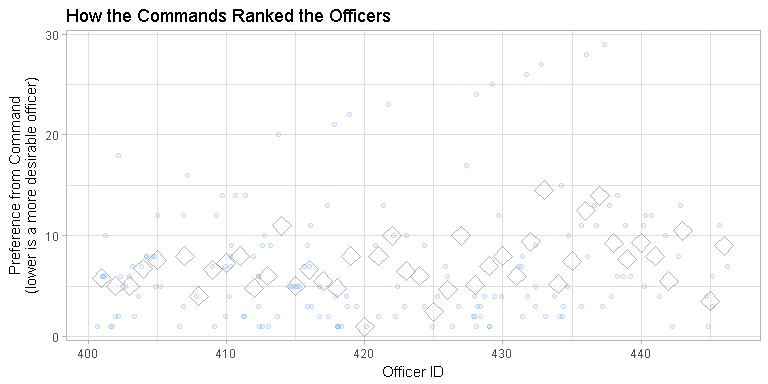
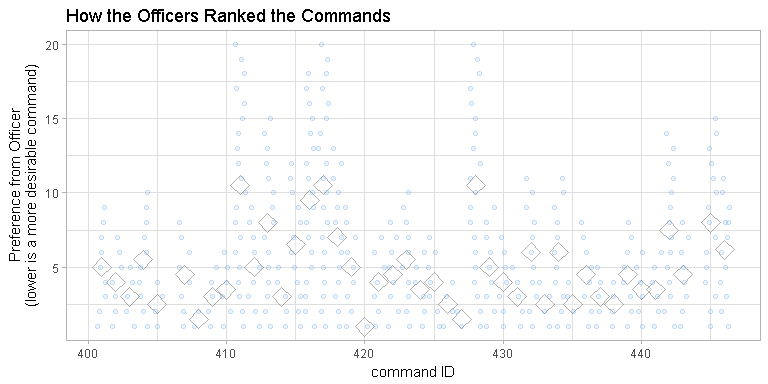

# Selection Demo of US Navy Billets
Date: `r Sys.Date()`  

This report demonstrates one approach to optimally match officers and ER billets.  The project is under the initial direction of [Richard C. Childers](mailto:richard.childers@navy.mil), CDR NPC, PERS-4415, with advisement from [Alvin Roth](http://web.stanford.edu/~alroth/).

<!--  Set the working directory to the repository's base directory; this assumes the report is nested inside of two directories.-->


<!-- Set the report-wide options, and point to the external code file. -->


<!-- Load the sources.  Suppress the output when loading sources. --> 


<!-- Load 'sourced' R files.  Suppress the output when loading packages. --> 


<!-- Load any global functions and variables declared in the R file.  Suppress the output. --> 


<!-- Declare any global functions specific to a Rmd output.  Suppress the output. --> 


<!-- Load the datasets.   -->


<!-- Tweak the datasets.   -->


Summary
===========================================

### Notes 
1. The current demonstration covers 26 officers, 22 unique hospitals, and 39 total possible billets.  
1. The four simulated datasets are viewable and editable [online](https://github.com/OuhscBbmc/usnavy-billets/tree/master/data-phi-free).
    * [roster of the hospitals](https://github.com/OuhscBbmc/usnavy-billets/blob/master/data-phi-free/raw/hospital-roster.csv).
    * [roster of the officers](https://github.com/OuhscBbmc/usnavy-billets/blob/master/data-phi-free/raw/officer-roster.csv).
    * [rankings inputted from the hospitals](https://github.com/OuhscBbmc/usnavy-billets/blob/master/data-phi-free/derived/hospital.csv).
    * [rankings inputted from the officers](https://github.com/OuhscBbmc/usnavy-billets/blob/master/data-phi-free/derived/officer.csv).
1. Although there can be multiple billets per hospital, an officer ranks the global hospital, instead of a specific billet.  Similarly, the hospital ranks an officer, instead of a billet ranking an officer.  The billet capacity of a hospital is considered during the matching process.
1. The following survey adequately addresses the current project needs, which involves only a few dozen hospitals and officers in one specialty.  The survey framework would need to be generalized and scaled out, depending on the additional volume and types of specializations. https://bbmc.ouhsc.edu/redcap/surveys/?s=7XNAFK337W

### Sources
1. This demonstration was developed primarily by [Will Beasley](http://ouhsc.edu/bbmc/team/), Assistant Professor of Research, University of Oklahoma College of Medicine, [Department of Pediatrics](http://www.oumedicine.com/pediatrics).  The code developed for the billet marketplace project is open source and [available online](https://github.com/OuhscBbmc/usnavy-billets).  
1. The project members are appreciative of the open source [`matchingMarkets`](https://cran.r-project.org/package=matchingMarkets) R package, (independently developed by [Thilo Klein](https://github.com/thiloklein) since [2013](https://github.com/thiloklein/matchingMarkets/commits/master)) that implements the Gale-Shapley (1962) Deferred Acceptance Algorithm. For further discussion, see [Roth (2007) Deferred Acceptance Algorithms: History, Theory, Practice, and
Open Questions](https://dash.harvard.edu/bitstream/handle/1/2579651/Roth_Deferred%20Acceptance.pdf) and the [2012 Nobel Prize material](http://www.nobelprize.org/nobel_prizes/economic-sciences/laureates/2012/press.html).
1. The most recent version of this demonstration report is available at https://github.com/OuhscBbmc/usnavy-billets/blob/master/analysis/select-1/select-1.md.

### Unanswered Questions

1. How should the process be adjusted to accommodate issues like (a) recent tours overseas, (b) seniority, and (c) cliques?  Our current plan is to set some a priori points, and approximate it with a transformation.  The transformed rankings are fed into the matching algorithm.
1. How should spousal placement (and other hard restrictions) be handled?  We are currently investigating what will happen if the other (nonacceptable sites) are left blank for the officer, and fed into the matching algorithm.
1. How should 'subjective retirement thresholds' be handled?  For instance, suppose an officer will retire if they don't match to San Diego.  If they're matched somewhere else and retire, how should their assigned billet be filled?  Does the algorithm need to be run another time?  If so, several runs might be required (if other people's thresholds fail on subsequent runs), which is undesirable.

### Answered Questions

 1. --

# Raw Rankings

These two tables represent the raw/initial rankings provided from each hospital (in the first table) and from each officer (in the second table).  No adjustments have been made yet to the rankings.

In the first table (i.e., "Input from Each *Hospital*"), each row represents a single hospital's preferences; each column represents a officer being ranked.  In constrast, in the second table (i.e., "Input Provided from Each *Officer*"), each row represents a single officer's preferences; each column represents a hopsital being ranked.

To walk through an example from the hospital's perspective, look at the fifth row in the first table.  The values represent how hospital ``h_205`` ranked the 26 officers.  The hospital's initial four officers (i.e., ``o_401, o_402, o_403, o_404``) were ranked  2, 17, 10, and 13.

To walk through an example from the officer's perspective, look at the second row in the second table.    The values represent how officer ``o_402`` ranked the 22 hospitals.  The officer's initial three hospitals (i.e., ``h_201, h_202, h_203``) were ranked  4, 21, and  3.

<!-- To walk through an example from the hospital's perspective, look at the fifth row in the first table.  The values represent how the 22 hospitals ranked officer ``o_405``.  The first four hospitals (i.e., ``h_201, h_202, h_203, h_204``) ranked officer ``o_405`` as 1, 1, 6, and 24.

To walk through an example from the officer's perspective, look at the second row in the second table.  The values represent how the 26 officers ranked hospital ``h_202``.  The first four officers (i.e., ``o_401, o_402, o_403, o_404``) ranked officer ``h_202`` as 7, 21, 15, and 2.-->


### Input Provided from Each Hospital


| hospital_id| o_401| o_402| o_403| o_404| o_405| o_406| o_407| o_408| o_409| o_410| o_411| o_412| o_413| o_414| o_415| o_416| o_417| o_418| o_419| o_420| o_421| o_422| o_423| o_424| o_425| o_426|
|-----------:|-----:|-----:|-----:|-----:|-----:|-----:|-----:|-----:|-----:|-----:|-----:|-----:|-----:|-----:|-----:|-----:|-----:|-----:|-----:|-----:|-----:|-----:|-----:|-----:|-----:|-----:|
|       h_201|    25|    13|     6|    16|     1|     7|    19|    14|     2|     5|     8|    20|    18|    22|    12|    23|     4|    26|    10|    17|     9|    11|     3|    15|    24|    21|
|       h_202|     2|     9|    23|    12|     1|     5|    20|    16|    11|    10|    25|     8|    17|    21|    14|    15|    24|     6|     4|    19|    18|    22|    13|     7|     3|    26|
|       h_203|     3|    12|    13|     5|     6|    14|    20|    17|    21|    25|     2|    18|    19|     4|    16|    24|    11|    15|    10|    26|     7|    23|     9|     1|    22|     8|
|       h_204|    20|    10|    16|     2|    24|    21|     8|    22|    26|    25|    18|     4|    15|    13|     5|     1|    17|    12|     6|    23|    11|     7|    19|     3|    14|     9|
|       h_205|     2|    17|    10|    13|    14|     5|    19|     6|     9|    11|    24|    21|    12|    26|    16|     1|     4|    22|    25|    18|    15|    20|     8|    23|     7|     3|
|       h_206|     2|    10|    23|     6|     8|    16|     4|    18|    17|     1|    22|     3|    13|    24|    19|    26|     9|    21|     7|    15|    14|    20|    12|    25|     5|    11|
|       h_207|    16|    22|    14|     6|    21|     1|    13|    19|    20|    26|     9|    25|    10|    12|    17|     8|    24|     2|    15|    11|     5|     4|     7|     3|    18|    23|
|       h_208|    16|    15|    26|     8|    12|    18|     9|    14|     3|     5|     2|    13|     6|     4|    22|    21|     7|    11|    23|    10|    20|    25|    24|    17|     1|    19|
|       h_209|     8|    12|    10|     5|     1|     9|     4|    20|     3|    16|    21|    26|    19|    13|    14|    23|     7|     6|    17|     2|    15|    22|    25|    11|    18|    24|
|       h_210|    23|     1|     3|    15|    20|    22|    25|     9|    18|     8|    13|    12|    11|    16|     2|     5|    21|    10|     6|     7|    19|     4|    17|    24|    14|    26|
|       h_211|    10|     6|    20|    16|     5|     3|    15|     4|    14|     7|     1|     8|    17|    18|    22|     2|    19|    12|    26|    24|    21|    11|    23|    25|     9|    13|
|       h_212|     3|    13|    17|    19|     2|    15|    20|     5|    22|     8|    12|    10|    21|    16|     1|    14|    25|    11|     7|    24|    18|    23|     6|     9|     4|    26|
|       h_213|    26|     4|    20|    13|    21|    15|     5|    11|     6|    22|     7|     9|    19|    14|    16|    23|    18|    24|    17|     2|     3|    10|    12|     1|    25|     8|
|       h_214|    10|    14|    21|    16|    23|    25|     2|     3|    19|    18|    17|     7|     6|     9|     1|     4|    11|    20|    13|    22|     8|     5|    12|    24|    15|    26|
|       h_215|    25|    21|     6|     8|     3|     4|    18|    13|    12|    14|     5|    16|    10|    17|    20|     1|     7|    15|     2|    26|    23|    19|     9|    22|    24|    11|
|       h_216|     4|    11|     6|     3|    15|    18|    12|    24|    20|    26|     7|     9|     1|    22|     8|     5|    19|    23|    14|    16|    25|     2|    13|    10|    21|    17|
|       h_217|     1|     3|     7|     9|    12|     4|    16|    14|    24|    20|    10|     8|    26|    21|    18|     5|    17|    22|    11|    15|     6|    25|    19|    23|     2|    13|
|       h_218|     8|    15|    23|    16|    11|    19|    13|    20|    18|     7|     5|    17|     3|     6|     1|    22|     4|    25|    24|    14|    12|    26|    21|     9|    10|     2|
|       h_219|     4|    20|    26|    19|    11|    16|    18|    24|     9|     5|     7|     2|     6|    22|     8|    10|    25|     3|    23|    14|    12|    13|    15|     1|    17|    21|
|       h_220|     9|     8|    13|    20|    18|     6|    24|     3|    19|     1|    23|    11|    26|    14|     5|    17|    25|    22|    12|    10|    21|     4|     7|     2|    16|    15|
|       h_221|    24|    17|     5|    16|     6|     3|    22|    26|     7|    12|    23|    21|     9|    11|     8|     2|    19|     4|    25|    20|    18|    10|     1|    13|    15|    14|
|       h_222|    17|    14|     9|    22|     4|    19|     3|     5|     8|    12|    15|     2|    25|    11|     7|     6|    23|    21|    16|    24|     1|    20|    26|    10|    13|    18|


### Input Provided from Each Officer


| officer_id| h_201| h_202| h_203| h_204| h_205| h_206| h_207| h_208| h_209| h_210| h_211| h_212| h_213| h_214| h_215| h_216| h_217| h_218| h_219| h_220| h_221| h_222|
|----------:|-----:|-----:|-----:|-----:|-----:|-----:|-----:|-----:|-----:|-----:|-----:|-----:|-----:|-----:|-----:|-----:|-----:|-----:|-----:|-----:|-----:|-----:|
|      o_401|    16|     7|    20|    21|    17|    19|     5|     8|     3|    13|    15|    12|     2|    18|    22|    11|     4|    10|     1|    14|     6|     9|
|      o_402|     4|    21|     3|    16|     7|    11|     1|     9|     8|     5|    15|    12|    10|    18|    19|    20|    17|     2|    13|    14|    22|     6|
|      o_403|    22|    15|    19|    16|    10|     6|     8|    20|    13|     4|     5|    12|    18|    17|     1|     9|    21|     2|     3|     7|    11|    14|
|      o_404|     9|     2|     3|    14|    10|     6|    22|    12|     5|    13|    15|     8|    18|     7|     4|    16|     1|    11|    17|    19|    20|    21|
|      o_405|     2|    20|     5|     9|     1|     8|    21|     7|    19|    13|    22|    10|     3|    12|     4|    16|    17|    14|    11|    15|    18|     6|
|      o_406|    15|     2|    12|    22|     8|    17|    18|    13|    16|     7|     6|     5|    19|    21|    20|     9|    10|     4|    11|     3|     1|    14|
|      o_407|     8|     3|     9|    10|    12|     5|    17|    14|    22|    13|     2|    16|    20|     1|    18|    19|    11|    15|     6|     7|     4|    21|
|      o_408|     9|     2|     6|     7|    17|    14|    12|     8|     5|    22|    13|    11|     4|    20|    21|    10|     3|     1|    16|    19|    18|    15|
|      o_409|     9|    13|     2|    16|     4|    19|    12|     5|    14|     8|     7|     6|    18|     1|    22|    20|    11|     3|    10|    15|    21|    17|
|      o_410|    10|    22|    14|     1|    13|    18|     8|     4|    16|     5|     7|     6|     3|    12|    17|     9|    21|    20|    11|    15|     2|    19|
|      o_411|    11|    15|     9|     5|    12|    14|     8|     7|     3|     4|    20|    16|    21|    17|    22|    10|    18|     6|    19|    13|     1|     2|
|      o_412|    20|    18|     5|    17|     1|     4|    14|    16|    22|     7|     3|    11|     8|     6|    13|    10|    21|     2|     9|    12|    15|    19|
|      o_413|    10|     2|     8|    19|    13|    16|    17|     3|     6|     1|    21|    22|     9|    18|    14|     5|     7|    12|    20|    15|    11|     4|
|      o_414|    21|     9|    18|     8|     5|    14|     4|     3|    15|    19|     1|    16|     6|    10|    22|    12|     7|    11|    20|    13|    17|     2|
|      o_415|     8|     3|    22|    11|    15|    12|    20|    17|     6|    21|    18|    13|     7|     5|     1|    14|     4|     9|    16|     2|    10|    19|
|      o_416|     4|    17|     1|     6|     8|    18|    19|    10|    12|     3|    20|     5|    11|    14|    16|     7|    15|    13|     2|     9|    21|    22|
|      o_417|    22|     4|    14|    20|     8|     5|    19|    11|    12|    13|    15|     6|     1|    18|     3|    17|    21|     2|     9|    16|    10|     7|
|      o_418|     5|    10|    17|    11|    19|    18|    13|    14|     1|     3|     6|     4|     7|    22|     2|    20|     9|    15|    21|    12|     8|    16|
|      o_419|     1|    11|     3|    17|     2|    10|     4|     9|    12|     5|    22|    16|     7|    13|    18|    19|    20|    14|    21|    15|     6|     8|
|      o_420|    19|     4|     1|     7|    10|     8|    20|    16|    22|    14|     3|     2|    15|    12|     5|    13|    17|     9|    18|    21|     6|    11|
|      o_421|     9|     7|     3|     2|    20|    11|     4|    21|    12|    14|     8|    10|     1|    18|    13|    16|     6|    15|    22|     5|    17|    19|
|      o_422|     8|     5|    13|    11|    12|    22|    17|    18|    19|     4|    14|    15|    21|     6|     1|    20|     9|     3|     2|    16|    10|     7|
|      o_423|     7|    17|    19|     5|     3|    20|     2|    18|     6|    21|    14|     8|     1|    13|    15|     4|    22|     9|    10|    12|    16|    11|
|      o_424|    21|    22|    11|    15|     8|    16|     1|     6|    20|    13|     9|     2|    19|    10|    17|     4|     3|    18|     5|     7|    14|    12|
|      o_425|     5|    17|    15|     6|    18|     1|     3|    11|    22|    10|    21|     8|     9|     2|     4|     7|    19|    12|    14|    13|    20|    16|
|      o_426|    18|     4|    14|    16|    20|     8|     7|     1|    12|     6|    19|    22|    21|    10|     9|    13|    15|    17|     5|     2|    11|     3|

Results
===========================================

Matches
-------------------------------------------

The skinny table below shows the pairs of hospital--officer matches.  Notice that not all entities were matched.  This is because there were 39 total billets (across 22 unique hospitals), but 26 officers.  This is only the essential information.  See the following section for a comprehensive table.

| hospital index|officer index |
|--------------:|:-------------|
|              1|19            |
|              1|*not matched* |
|              3|7             |
|              3|*not matched* |
|              4|2             |
|              4|16            |
|              5|18            |
|              5|25            |
|              5|22            |
|              7|23            |
|              7|21            |
|              8|15            |
|              9|4             |
|              9|8             |
|              9|9             |
|             10|13            |
|             11|11            |
|             12|*not matched* |
|             13|*not matched* |
|             13|*not matched* |
|             15|6             |
|             15|*not matched* |
|             15|*not matched* |
|             16|1             |
|             16|26            |
|             16|*not matched* |
|             16|*not matched* |
|             16|*not matched* |
|             16|*not matched* |
|             17|*not matched* |
|             17|*not matched* |
|             18|14            |
|             18|12            |
|             19|20            |
|             20|5             |
|             21|24            |
|             22|3             |
|             22|17            |
|             22|10            |

Display
-------------------------------------------

The final table shows the indices of only the successful matches, along with the following information:

* the hopsital ID and name (`hospital id` and `hospital name`), 
* the maximum number of billets for a hospital (`billet count max`),
* the officer ID and name  (`officer id` and `officer name last`), 
* the preference expressed from the hospital for the officer (`preference from hospital`)
* the preference expressed from the officer for the hospital (`preference from officer`)

In this demonstration, notice that not all hospitals filled every billet.


| hospital<br/>index| officer<br/>index| hospital<br/>id|hospital<br/>name | billet<br/>count<br/>max| officer<br/>id|officer<br/>name<br/>last | preference<br/>from<br/>hospital| preference<br/>from<br/>officer|
|------------------:|-----------------:|---------------:|:-----------------|------------------------:|--------------:|:-------------------------|--------------------------------:|-------------------------------:|
|                 16|                 1|             216|NMCP              |                        6|            401|Abraham                   |                                4|                              11|
|                 16|                26|             216|NMCP              |                        6|            426|Zimmer                    |                               17|                              13|
|                  5|                18|             205|NHCL              |                        3|            418|Rampling                  |                               22|                              19|
|                  5|                22|             205|NHCL              |                        3|            422|Vaughan                   |                               20|                              12|
|                  5|                25|             205|NHCL              |                        3|            425|Young                     |                                7|                              18|
|                  9|                 4|             209|NHCP              |                        3|            404|Davidson                  |                                5|                               5|
|                  9|                 8|             209|NHCP              |                        3|            408|Harris                    |                               20|                               5|
|                  9|                 9|             209|NHCP              |                        3|            409|Ince                      |                                3|                              14|
|                 15|                 6|             215|NH Napl           |                        3|            406|Forsyth                   |                                4|                              20|
|                 22|                 3|             222|NH Yoko           |                        3|            403|Carr                      |                                9|                              14|
|                 22|                10|             222|NH Yoko           |                        3|            410|Jones                     |                               12|                              19|
|                 22|                17|             222|NH Yoko           |                        3|            417|Quinn                     |                               23|                               7|
|                  1|                19|             201|NH Guam           |                        2|            419|Sutherland                |                               10|                               1|
|                  3|                 7|             203|Lejeune MEU       |                        2|            407|Glover                    |                               20|                               9|
|                  4|                 2|             204|Lejeune MLG       |                        2|            402|Bailey                    |                               10|                              16|
|                  4|                16|             204|Lejeune MLG       |                        2|            416|Paige                     |                                1|                               6|
|                  7|                21|             207|Oki MLG           |                        2|            421|Underwood                 |                                5|                               4|
|                  7|                23|             207|Oki MLG           |                        2|            423|Walker                    |                                7|                               2|
|                 18|                12|             218|NMCSD             |                        2|            412|Lambert                   |                               17|                               2|
|                 18|                14|             218|NMCSD             |                        2|            414|Nash                      |                                6|                              11|
|                  8|                15|             208|Oki MEU           |                        1|            415|Oliver                    |                               22|                              17|
|                 10|                13|             210|Ft Belv           |                        1|            413|Murray                    |                               11|                               1|
|                 11|                11|             211|Guant             |                        1|            411|Knox                      |                                1|                              20|
|                 19|                20|             219|NH Sig            |                        1|            420|Taylor                    |                               14|                              18|
|                 20|                 5|             220|NHTP              |                        1|            405|Ellison                   |                               18|                              15|
|                 21|                24|             221|WHMP              |                        1|            424|Xiong                     |                               13|                              14|


Desirability
-------------------------------------------

Finally, the desirability of the the entities can be represented several ways.  Perhaps the simplest is plotting how the each ranked each other.  In the first graph, each column represents the rankings received by an officer; the diamond represents the officer's mean rank.  If all hospitals believed the officer was the best fit for them, all 22 blue dots (as well as the diamond) would be at $y$=1.  The second graph is similar, but reflects the desirability of each hospital, from the officer's perspective.  These blue points are distributed more evenly than in the real world, because the preference data was (simply) generated.

<!-- --><!-- -->


Session Information
===========================================
We would like to address any questions or suggestions during any stage of the evaluation. Please contact [Richard C. Childers](mailto:richard.childers@navy.mil), CDR NPC, PERS-4415.

For the sake of documentation and reproducibility, the current report was rendered on a system using the following software.


```
Report rendered by Will at 2016-06-01, 10:50 -0500
```

```
R version 3.3.0 Patched (2016-05-05 r70588)
Platform: x86_64-w64-mingw32/x64 (64-bit)
Running under: Windows >= 8 x64 (build 9200)

locale:
[1] LC_COLLATE=English_United States.1252  LC_CTYPE=English_United States.1252   
[3] LC_MONETARY=English_United States.1252 LC_NUMERIC=C                          
[5] LC_TIME=English_United States.1252    

attached base packages:
[1] stats     graphics  grDevices utils     datasets  methods   base     

other attached packages:
[1] ggplot2_2.1.0 magrittr_1.5  knitr_1.13   

loaded via a namespace (and not attached):
 [1] Rcpp_0.12.5           partitions_1.9-18     munsell_0.4.3         colorspace_1.2-6     
 [5] R6_2.1.2              highr_0.6             stringr_1.0.0         plyr_1.8.3           
 [9] dplyr_0.4.3           tools_3.3.0           parallel_3.3.0        grid_3.3.0           
[13] lpSolve_5.6.13        gtable_0.2.0          DBI_0.4-1             htmltools_0.3.5      
[17] matchingMarkets_0.2-1 lazyeval_0.1.10       assertthat_0.1        yaml_2.1.13          
[21] digest_0.6.9          gmp_0.5-12            readr_0.2.2           formatR_1.4          
[25] tidyr_0.4.1           evaluate_0.9          rmarkdown_0.9.6       labeling_0.3         
[29] stringi_1.1.1         scales_0.4.0          polynom_1.3-8        
```
