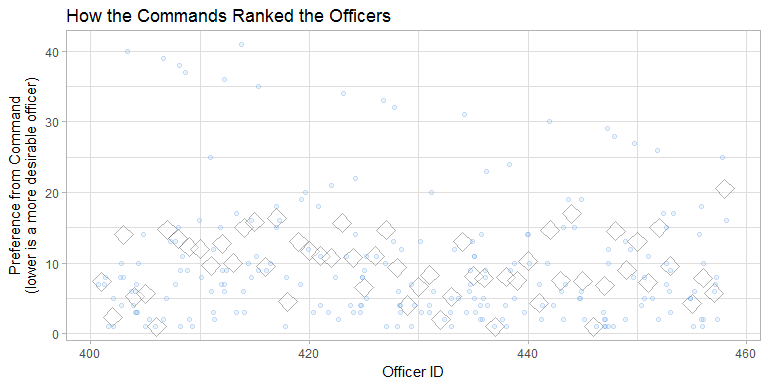
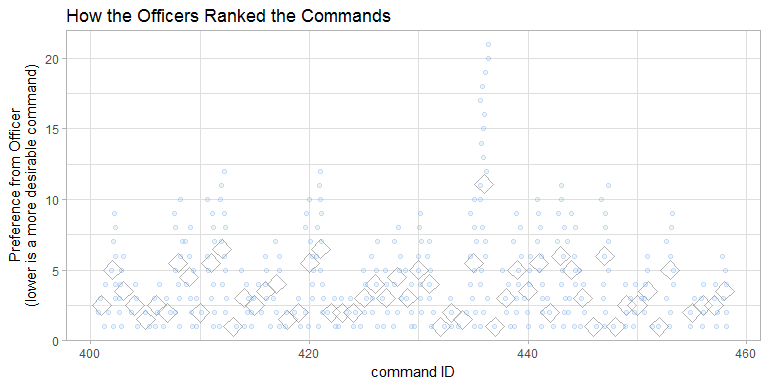

# Selection Demo of US Navy Detailing Marketplace Pilot Program
Date: `r Sys.Date()`  

This report demonstrates one approach to optimally match officers and ER billets.  The project is under the initial direction of [Richard C. Childers](mailto:richard.childers@navy.mil), CDR NPC, PERS-4415, with advisement from [Alvin Roth](http://web.stanford.edu/~alroth/).

<!--  Set the working directory to the repository's base directory; this assumes the report is nested inside of two directories.-->


<!-- Set the report-wide options, and point to the external code file. -->


<!-- Load the sources.  Suppress the output when loading sources. --> 


<!-- Load 'sourced' R files.  Suppress the output when loading packages. --> 


<!-- Load any global functions and variables declared in the R file.  Suppress the output. --> 


<!-- Declare any global functions specific to a Rmd output.  Suppress the output. --> 


<!-- Load the datasets.   -->


<!-- Tweak the datasets.   -->


Summary
===========================================

### Background

To increase billet assignment transparency, and to give members and commands more control of the process, 2017 Navy Emergency Medicine Billets will be assigned using a detailing marketplace.  This is a pilot project within the Navy's larger effort to modernize the personnel system.  
  
A list of available billets will be published in the summer of 2016 for physicians to compete for.  At the same time, a list of officers/physicians up for orders will be made available for commands to recruit.  In January, rank lists from officers and commands will be submitted and run through the deferred acceptance algorithm.  The algorithm, used in the National Resident Matching Program, will optimize a match between officer and command.

What follows is a demonstration of the algorithm using theoretical data.

### Notes 
1. The current demonstration covers 46 officers, 20 unique commands, and 47 total possible billets.  In the specialty of emergency medicine, the term "command" and "hospital" can almost be used interchangably.  Almost all commands are located in a single command, and each command/hospital can have multiple billets.
1. The four simulated datasets are viewable and editable [online](https://github.com/OuhscBbmc/usnavy-billets/tree/master/data-phi-free).
    * [roster of the commands](https://github.com/OuhscBbmc/usnavy-billets/blob/master/data-phi-free/raw/command-roster.csv).
    * [roster of the officers](https://github.com/OuhscBbmc/usnavy-billets/blob/master/data-phi-free/raw/officer-roster.csv).
    * [rankings inputted from the commands](https://github.com/OuhscBbmc/usnavy-billets/blob/master/data-phi-free/derived/command.csv).
    * [rankings inputted from the officers](https://github.com/OuhscBbmc/usnavy-billets/blob/master/data-phi-free/derived/officer.csv).
1. Although there can be multiple billets per command, an officer ranks the global command, instead of a specific billet.  Similarly, the command ranks an officer, instead of a billet ranking an officer.  The billet capacity of a command is considered during the matching process.
1. The following survey adequately addresses the current project needs, which involves only a few dozen commands and officers in one specialty.  The survey framework would need to be generalized and scaled out, depending on the additional volume and types of specializations. https://bbmc.ouhsc.edu/redcap/surveys/?s=7XNAFK337W

### Sources
1. This demonstration was developed primarily by [Will Beasley](http://ouhsc.edu/bbmc/team/), Assistant Professor of Research, University of Oklahoma College of Medicine, [Department of Pediatrics](http://www.oumedicine.com/pediatrics).  The code developed for the billet marketplace project is open source and [available online](https://github.com/OuhscBbmc/usnavy-billets).  
1. The project members are appreciative of the open source [`matchingMarkets`](https://cran.r-project.org/package=matchingMarkets) R package, (independently developed by [Thilo Klein](https://github.com/thiloklein) since [2013](https://github.com/thiloklein/matchingMarkets/commits/master)) that implements the Gale-Shapley (1962) Deferred Acceptance Algorithm. For further discussion, see [Roth (2007) Deferred Acceptance Algorithms: History, Theory, Practice, and
Open Questions](https://dash.harvard.edu/bitstream/handle/1/2579651/Roth_Deferred%20Acceptance.pdf) and the [2012 Nobel Prize material](http://www.nobelprize.org/nobel_prizes/economic-sciences/laureates/2012/press.html).
1. The [most recent version](https://rawgit.com/OuhscBbmc/usnavy-billets/master/analysis/select-1/select-1.html) of this demonstration report is available in the [public repository](https://github.com/OuhscBbmc/usnavy-billets).  (An [alternate location](https://github.com/OuhscBbmc/usnavy-billets/blob/master/analysis/select-1/select-1.md) is also available.)

### Unanswered Questions

1. How should the process be adjusted to accommodate issues like (a) recent tours overseas, (b) seniority, and (c) cliques?  Our current plan is to set some a priori points, and approximate it with a transformation.  The transformed rankings are fed into the matching algorithm.
1. How should spousal placement (and other hard restrictions) be handled?  We are currently investigating what will happen if the other (nonacceptable sites) are left blank for the officer, and fed into the matching algorithm.
1. How should 'subjective retirement thresholds' be handled?  For instance, suppose an officer will retire if they don't match to San Diego.  If they're matched somewhere else and retire, how should their assigned billet be filled?  Does the algorithm need to be run another time?  If so, several runs might be required (if other people's thresholds fail on subsequent runs), which is undesirable.
1. How can we adjust the process to match members married to other active duty members (COLOs) or enrolled in the Exceptional Family Member Program (EFMP) who have limited billet-assignment options.  That is, some members will have to be matched to certain billets even if those commands do not rank them highly.
1. How can we adjust the process to allow members to not match?  Specifically, some members have no obligation to stay in the Navy and can elect to get out if they do not get their preferred pick.  How do we allow this without affecting the integrity of the algorithm?
1. How do we incentivize less desirable commands?
1. How do we mitigate the advantage on-board members may have in securing an extension or retour?


### Answered Questions

 1. --

# Raw Rankings

These two tables represent the raw/initial rankings provided from each command (in the first table) and from each officer (in the second table).  No adjustments have been made yet to the rankings.

In the first table (i.e., "Input from Each *Command*"), each row represents a single command's preferences; each column represents a officer being ranked.  In constrast, in the second table (i.e., "Input Provided from Each *Officer*"), each row represents a single officer's preferences; each column represents a hopsital being ranked.


### Input Provided from Each Command


| college_id| 401| 402| 403| 404| 405| 406| 407| 408| 409| 410| 411| 412| 413| 414| 415| 416| 417| 418| 419| 420| 421| 422| 423| 424| 425| 426| 427| 428| 429| 430| 431| 432| 433| 434| 435| 436| 437| 438| 439| 440| 441| 442| 443| 444| 445| 446|
|----------:|---:|---:|---:|---:|---:|---:|---:|---:|---:|---:|---:|---:|---:|---:|---:|---:|---:|---:|---:|---:|---:|---:|---:|---:|---:|---:|---:|---:|---:|---:|---:|---:|---:|---:|---:|---:|---:|---:|---:|---:|---:|---:|---:|---:|---:|---:|
|        201|   -|   1|   -|   -|   -|   -|   -|   -|   -|   -|   -|   -|   -|   -|   -|   -|   -|   -|   -|   -|   -|   -|   -|   -|   -|   -|   -|   -|   -|   -|   -|   -|   -|   -|   -|   -|   -|   -|   -|   -|   -|   -|   -|   -|   -|   -|
|        202|  10|  18|   5|   7|   8|  19|  16|   -|  12|   -|   2|   3|   9|  20|   -|  11|  13|  21|  22|   -|   -|  23|   -|   -|   -|   -|  17|  24|  25|   -|   -|  26|  27|  15|   -|  28|  29|  14|   6|   -|   -|   1|   -|   -|   4|   -|
|        203|   -|   -|   -|   -|   -|   -|   -|   -|   -|   -|   -|   -|   -|   -|   -|   -|   -|   -|   -|   -|   -|   -|   -|   -|   -|   -|   -|   1|   -|   -|   -|   -|   -|   -|   -|   -|   -|   -|   -|   -|   -|   -|   -|   -|   -|   -|
|        204|   -|   -|   -|   -|   -|   -|   -|   -|   -|   -|   -|   -|   1|   -|   -|   -|   -|   -|   -|   -|   -|   -|   -|   -|   -|   -|   -|   2|   -|   -|   -|   -|   -|   -|   -|   -|   -|   -|   -|   -|   -|   -|   -|   -|   -|   -|
|        205|   -|   -|   -|   -|   -|   -|   -|   -|   -|   -|   -|   -|   -|   -|   -|   -|   -|   -|   3|   -|   -|   2|   -|   -|   -|   -|   -|   -|   -|   -|   -|   -|   -|   -|   -|   -|   -|   -|   -|   -|   -|   -|   -|   -|   1|   -|
|        206|   -|   2|   -|   -|   -|   -|   -|   -|   -|   -|   -|   -|   -|   -|   -|   -|   -|   1|   -|   -|   -|   -|   -|   -|   -|   -|   -|   4|   -|   -|   -|   -|   -|   3|   -|   -|   -|   -|   -|   -|   -|   -|   -|   -|   -|   -|
|        207|   -|   6|   -|   -|   -|   -|   -|   -|   -|   -|   -|   -|   -|   -|   5|   -|   2|   1|   -|   -|   -|   -|   -|   -|   -|   7|   -|   3|   -|   -|   -|   -|   -|   4|   -|   -|   -|   -|   -|   -|   -|   -|   -|   -|   -|   -|
|        208|   -|   1|   -|   -|   -|   -|   -|   -|   -|   -|   -|   -|   -|   -|   5|   -|   -|   -|   -|   -|   -|   -|   -|   -|   4|   -|   -|   -|   -|   -|   -|   -|   -|   2|   -|   -|   3|   -|   -|   -|   -|   -|   -|   -|   -|   -|
|        209|   6|   -|   -|   8|   5|   -|  12|   4|   7|  14|   -|   -|   -|   -|   -|   -|   -|   -|   -|   1|   -|   -|  10|   9|   -|   -|   3|   -|   -|   -|   -|   -|   -|   2|   -|   -|   -|  13|   -|  11|   -|   -|   -|   -|   -|   -|
|        210|   -|   -|   -|   -|   -|   -|   1|   -|   -|   -|   -|   -|   -|   2|   5|   7|   -|   -|   -|   -|   -|   -|   3|   -|   -|   -|   -|   -|   -|   4|   -|   -|   -|   -|   -|   -|   -|   -|   -|   -|   -|   -|   8|   -|   6|   -|
|        211|   -|   2|   -|   -|   -|   -|   3|   -|   -|   -|   -|   -|   -|   -|   -|   -|   -|   1|   -|   -|   -|   -|   -|   -|   -|   -|   -|   -|   -|   -|   -|   -|   -|   -|   -|   -|   -|   4|   -|   -|   -|   -|   -|   -|   -|   -|
|        212|   1|   -|   -|   4|   5|   -|   -|   -|   -|   2|   -|   8|   -|   -|   -|   7|   -|   -|   -|   -|   9|   -|   -|   -|   -|   -|   -|   -|   -|   -|   -|   -|   -|   -|   -|   -|   -|   6|  11|  12|   -|  10|   -|   -|   3|   -|
|        213|   6|   -|   -|   8|   -|   -|   -|   -|   -|   7|   -|   1|   9|   -|   -|   3|   -|   -|   -|   -|   -|   -|   -|   -|   -|   -|   -|   2|   -|   -|   -|   4|   -|   -|   -|   -|   -|   -|   -|   5|   -|   -|   -|   -|   -|   -|
|        214|   6|   -|   -|   -|   -|   -|   -|   -|   -|   4|   2|   -|   1|   -|   -|   -|   -|   -|   -|   -|   -|   -|   -|   -|   -|   -|   -|   3|   -|   -|   -|   5|   -|   -|   -|   -|   -|   -|   -|   -|   -|   -|   -|   -|   -|   -|
|        215|   -|   -|   2|   -|   -|   -|   -|   -|   -|   -|   -|   -|   -|   -|   -|   -|   -|   -|   -|   -|   -|   -|   -|   -|   1|   -|   -|   -|   -|   -|   -|   -|   -|   -|   -|   -|   -|   -|   -|   -|   -|   -|   -|   -|   -|   -|
|        216|   -|   -|   -|   -|   -|   -|   -|   -|   1|   -|   -|   -|   -|   -|   -|   -|   5|   -|   4|   -|   -|   -|   -|   3|   -|   6|   -|   -|   -|   -|   -|   -|   2|   -|   -|   -|   -|   -|   -|   -|   -|   -|   -|   -|   -|   7|
|        217|   -|   -|   6|   -|   -|   -|   -|   -|   -|   9|   -|   -|   -|   -|   5|   3|   2|   4|   -|   -|   -|  10|   -|   -|   -|   -|   -|   -|   1|  12|   7|   -|   -|   -|   -|   8|  13|   -|   -|   -|   -|   -|   -|   -|   -|  11|
|        218|   -|   -|   7|   -|   8|   -|   -|   -|   -|   -|   -|   -|   -|   -|   -|   -|   -|   1|   3|   -|   -|   5|   -|   -|   -|   -|   -|   -|   4|   -|   2|   -|   -|   -|   -|   -|   -|   -|   6|   -|   -|   -|   -|   -|   -|   -|
|        219|   -|   -|   -|   -|   -|   -|   -|   -|   -|   7|  14|   6|   -|   -|   5|   9|   -|   -|   -|   -|   2|   -|   -|   -|   -|   1|   -|   -|   4|   -|   8|   3|   -|   -|  10|  11|   -|   -|   -|   -|  12|   -|  13|   -|   -|   -|
|        220|   -|   -|   -|   -|  12|   -|   -|   -|   -|   8|  14|   6|  10|   -|   -|   -|   -|   -|   -|   -|  13|   -|   -|   -|   -|   -|   -|   2|   1|   -|   7|   9|   -|   -|   5|   3|  11|   -|   -|   -|   4|   -|   -|   -|   -|   -|


### Input Provided from Each Officer


| student_id| 201| 202| 203| 204| 205| 206| 207| 208| 209| 210| 211| 212| 213| 214| 215| 216| 217| 218| 219| 220|
|----------:|---:|---:|---:|---:|---:|---:|---:|---:|---:|---:|---:|---:|---:|---:|---:|---:|---:|---:|---:|---:|
|        401|   -|   -|   -|   -|   -|   -|   -|   -|   1|   3|   -|   2|   4|   5|   9|   6|   -|   -|   7|   8|
|        402|   4|   -|   -|   -|   -|   2|   1|   3|   -|   -|   5|   -|   -|   -|   -|   6|   -|   7|   -|   -|
|        403|   -|   5|   -|   -|   -|   -|   -|   -|   -|   2|   -|   3|   -|   -|   -|   -|   4|   1|   -|   -|
|        404|   9|   -|   -|   -|   5|   6|   7|   8|   1|   4|   -|   3|   -|   -|   -|   2|   -|  10|   -|   -|
|        405|   -|   -|   -|   -|   -|   -|   -|   -|   1|   -|   -|   2|   -|   -|   -|   -|   -|   -|   3|   4|
|        406|   -|   -|   -|   -|   -|   2|   1|   3|   7|   5|   -|   4|   -|   -|   -|   6|   -|   8|   -|   -|
|        407|   -|   8|   -|   -|   4|   5|   6|   7|   3|   1|   2|   -|   -|   -|   -|   -|   -|   -|   -|   -|
|        408|   -|   -|   -|   -|   -|   -|   -|   -|   1|   2|   -|   -|   -|   -|   -|   -|   -|   -|   -|   -|
|        409|   -|   -|   -|   -|   -|   3|   4|   5|   2|   -|   -|   -|   -|   -|   -|   1|   -|   -|   -|   -|
|        410|   -|   -|   -|   -|   -|   -|   -|   -|   3|   5|   -|   1|   -|   -|   -|   -|   -|   4|   2|   6|
|        411|  13|   6|   8|   7|  14|  15|  16|  17|  11|  10|  18|   3|   2|   1|  20|  12|  19|   9|   5|   4|
|        412|   1|   3|   -|   -|   -|   -|   -|   -|   -|   2|   -|   4|   5|   6|   -|   -|   -|   9|   7|   8|
|        413|   -|   -|   7|   6|   -|   9|   -|  10|  15|   8|  14|   2|   3|   1|   -|  11|  12|  13|   5|   4|
|        414|   -|   -|   -|   -|   -|   -|   5|   -|   3|   1|   -|   4|   -|   -|   -|   2|   -|   -|   -|   -|
|        415|   -|   -|   -|   -|   -|   -|  11|   -|   5|   1|   -|  12|   8|   9|  10|   7|   2|   6|   3|   4|
|        416|   1|  11|  13|  12|  14|  15|  16|  17|  10|   2|   -|   3|   6|   8|   -|  18|   4|   5|   7|   9|
|        417|  20|  17|  18|  19|  16|   7|   6|   8|   4|   5|  15|  13|  14|  12|  11|   1|   3|   2|  10|   9|
|        418|  10|  11|   -|   -|   9|   4|   6|   7|  13|   5|   2|  12|   -|   -|   -|   8|   3|   1|   -|   -|
|        419|   -|   -|   -|   -|   9|   7|   8|   -|   3|   5|   -|   -|   -|   -|   -|   1|   -|   2|   4|   6|
|        420|   -|   -|   -|   -|   -|   -|   -|   -|   1|   -|   -|   -|   -|   -|   -|   -|   -|   -|   -|   -|
|        421|   -|   -|   -|   -|   -|   -|   -|   -|   5|   7|   -|   6|   -|   -|   -|   1|   -|   2|   3|   4|
|        422|   1|   -|   -|   -|   4|   6|   7|   5|   -|   2|   -|   -|   -|   -|   -|   8|   -|   3|   -|   -|
|        423|   -|   -|   -|   -|   -|   -|   -|   -|   4|   1|   -|   5|   8|   9|  10|   2|   -|   3|   6|   7|
|        424|   -|   -|   -|   -|   -|   -|   -|   -|   1|   3|   -|   4|   -|   -|   -|   2|   6|   5|   -|   -|
|        425|   -|   -|   -|   -|   -|   -|   -|   6|   5|   2|   -|   7|   -|   -|   1|   3|   -|   4|   -|   -|
|        426|   -|   -|   -|   -|   -|   -|   4|   -|   -|   2|   -|   -|   -|   -|   -|   3|   -|   -|   1|   -|
|        427|   -|   -|   -|   -|   -|   -|   -|   -|   1|   -|   -|   2|   -|   -|   -|   -|   -|   -|   -|   -|
|        428|  18|  10|   2|   1|  11|   8|   7|   9|  14|  19|  12|  16|   4|   3|  20|  13|  17|  15|   6|   5|
|        429|   -|   -|   -|   -|   -|   -|   -|   -|   9|   5|   8|   6|   7|   -|   -|   -|   1|   3|   2|   4|
|        430|   -|   -|   -|   -|   -|   -|   -|   -|   7|   1|   -|   -|   -|   -|   -|   4|   3|   2|   6|   5|
|        431|   -|   -|   -|   -|   -|   -|   -|   -|   -|   -|   -|   -|   -|   -|   -|   2|   5|   3|   4|   1|
|        432|   -|   -|   -|   -|   -|   -|   -|   -|   9|   8|  10|   7|   5|   6|   -|   4|  11|   3|   1|   2|
|        433|   -|   -|   -|   -|   -|   -|   -|   -|   2|   -|   -|   -|   -|   3|   -|   1|   -|   -|   -|   4|
|        434|   9|   -|   -|   -|   8|   5|   6|   7|   1|   2|   -|   4|   -|   -|  10|   3|   -|  11|   -|   -|
|        435|   -|   -|   -|   -|   -|   -|   -|   -|   -|   -|   -|   -|   -|   -|   -|   4|   -|   1|   2|   3|
|        436|   -|   -|   -|   -|   8|   6|   5|   4|   -|   -|   -|   -|   -|   -|   -|   3|   7|   -|   1|   2|
|        437|   5|   -|   -|   -|   -|   -|   -|   -|   -|   -|   -|   -|   -|   -|   -|   -|   4|   3|   2|   1|
|        438|   -|   -|   -|   -|   -|   -|   -|   -|   1|   3|   -|   2|   -|   -|   4|   -|   -|   -|   -|   -|
|        439|   -|   -|   -|   -|   -|   -|   -|   -|   7|   3|   -|   4|   -|   -|   -|   1|   8|   2|   5|   6|
|        440|   -|   -|   -|   -|   -|   -|   -|   -|   1|   5|   -|   4|   3|   2|   -|   6|   -|   -|   -|   -|
|        441|   -|   -|   -|   -|   -|   -|   -|   -|   6|   5|   -|   -|   -|   -|   -|   3|   -|   4|   1|   2|
|        442|   -|   1|  14|  10|   -|   -|   -|   -|   7|   3|   -|   4|   9|  13|  11|   6|   5|   2|   8|  12|
|        443|   -|   -|   -|   -|   -|   -|   -|   -|   6|   1|   7|   -|   -|   -|   8|   5|   -|   4|   2|   3|
|        444|   -|   -|   -|   -|   -|   -|   -|   -|   4|   1|   -|   3|  10|   8|   -|   2|   6|   5|   7|   9|
|        445|   1|   3|  10|  11|   2|   -|   -|   -|   6|   4|   -|   5|  12|  13|   -|   8|   9|   7|  14|  15|
|        446|   -|   -|   -|   -|   8|   -|   -|   -|   3|   4|   -|   5|  11|  10|   7|   1|   6|   2|   9|   8|

Results
===========================================


### Pre-screen

Commands and officers must be excluded from the matching algorithm if none of their choices ranked them back.


```
The following 0 colleges/commands were never ranked by students/officers who ranked them: .  They will be removed.
```

```
The following 2 students/officers were never ranked by colleges/commands who ranked them: 406, 444.  They will be removed.
```

### Preference


```


### Input Provided from Each Command
```


|  1|  2|  3|  4|  5|  6|  7|  8|  9| 10| 11| 12| 13| 14| 15| 16| 17| 18| 19| 20|
|--:|--:|--:|--:|--:|--:|--:|--:|--:|--:|--:|--:|--:|--:|--:|--:|--:|--:|--:|--:|
|  2| 41| 27| 12| 43| 17| 17|  2| 19|  6| 17|  1| 11| 12| 24|  8| 28| 17| 25| 28|
|  -| 10|  -| 27| 21|  2| 16| 33| 33| 13|  2|  9| 27| 10|  3| 32| 16| 30| 20| 27|
|  -| 11|  -|  -| 18| 33| 27| 36| 26| 22|  6| 43| 15| 27|  -| 23| 15| 18| 31| 35|
|  -| 43|  -|  -|  -| 27| 33| 24|  7| 29| 37|  4| 31|  9|  -| 18| 17| 28| 28| 40|
|  -|  3|  -|  -|  -|  -| 14| 14|  5| 14|  -|  5| 39| 31|  -| 16| 14| 21| 14| 34|
|  -| 38|  -|  -|  -|  -|  2|  -|  1| 43|  -| 37|  1|  1|  -| 25|  3| 38| 11| 11|
|  -|  4|  -|  -|  -|  -| 25|  -|  8| 15|  -| 15|  9|  -|  -| 44| 30|  3|  9| 30|
|  -|  5|  -|  -|  -|  -|  -|  -|  4| 42|  -| 11|  4|  -|  -|  -| 35|  5| 30|  9|
|  -| 12|  -|  -|  -|  -|  -|  -| 23|  -|  -| 20| 12|  -|  -|  -|  9|  -| 15| 31|
|  -|  1|  -|  -|  -|  -|  -|  -| 22|  -|  -| 41|  -|  -|  -|  -| 21|  -| 34| 12|
|  -| 15|  -|  -|  -|  -|  -|  -| 39|  -|  -| 38|  -|  -|  -|  -| 44|  -| 35| 36|
|  -|  8|  -|  -|  -|  -|  -|  -|  6|  -|  -| 39|  -|  -|  -|  -| 29|  -| 40|  5|
|  -| 16|  -|  -|  -|  -|  -|  -| 37|  -|  -|  -|  -|  -|  -|  -| 36|  -| 42| 20|
|  -| 37|  -|  -|  -|  -|  -|  -|  9|  -|  -|  -|  -|  -|  -|  -|  -|  -| 10| 10|
|  -| 33|  -|  -|  -|  -|  -|  -|  -|  -|  -|  -|  -|  -|  -|  -|  -|  -|  -|  -|
|  -|  6|  -|  -|  -|  -|  -|  -|  -|  -|  -|  -|  -|  -|  -|  -|  -|  -|  -|  -|
|  -| 26|  -|  -|  -|  -|  -|  -|  -|  -|  -|  -|  -|  -|  -|  -|  -|  -|  -|  -|
|  -|  2|  -|  -|  -|  -|  -|  -|  -|  -|  -|  -|  -|  -|  -|  -|  -|  -|  -|  -|
|  -| 13|  -|  -|  -|  -|  -|  -|  -|  -|  -|  -|  -|  -|  -|  -|  -|  -|  -|  -|
|  -| 17|  -|  -|  -|  -|  -|  -|  -|  -|  -|  -|  -|  -|  -|  -|  -|  -|  -|  -|
|  -| 18|  -|  -|  -|  -|  -|  -|  -|  -|  -|  -|  -|  -|  -|  -|  -|  -|  -|  -|
|  -| 21|  -|  -|  -|  -|  -|  -|  -|  -|  -|  -|  -|  -|  -|  -|  -|  -|  -|  -|
|  -| 27|  -|  -|  -|  -|  -|  -|  -|  -|  -|  -|  -|  -|  -|  -|  -|  -|  -|  -|
|  -| 28|  -|  -|  -|  -|  -|  -|  -|  -|  -|  -|  -|  -|  -|  -|  -|  -|  -|  -|
|  -| 31|  -|  -|  -|  -|  -|  -|  -|  -|  -|  -|  -|  -|  -|  -|  -|  -|  -|  -|
|  -| 32|  -|  -|  -|  -|  -|  -|  -|  -|  -|  -|  -|  -|  -|  -|  -|  -|  -|  -|
|  -| 35|  -|  -|  -|  -|  -|  -|  -|  -|  -|  -|  -|  -|  -|  -|  -|  -|  -|  -|
|  -| 36|  -|  -|  -|  -|  -|  -|  -|  -|  -|  -|  -|  -|  -|  -|  -|  -|  -|  -|

```


### Input Provided from Each Command --recoded
```


| choice | 1st MEU | 1st MLG | 2nd MEU | 2nd MLG | 3rd MLG | CBIRF | Gitmo | Guam | Jax | Napl | NH 29P | NH Oki | NH Pend | NH Yoko | NHCL | NMCP | NMCSD | Oki MEU | Rota | Sig |
|:------:|:-------:|:-------:|:-------:|:-------:|:-------:|:-----:|:-----:|:----:|:---:|:----:|:------:|:------:|:-------:|:-------:|:----:|:----:|:-----:|:-------:|:----:|:---:|
|   1    |   429   |   426   |   413   |   412   |   413   |  425  |  418  | 402  | 407 | 418  |  429   |  442   |   418   |   445   | 401  | 420  |  409  |   428   | 418  | 402 |
|   2    |   428   |   421   |   411   |   428   |   428   |  403  |  402  |  -   | 414 | 417  |  417   |  411   |   431   |   422   | 410  | 434  |  433  |    -    | 402  | 434 |
|   3    |   436   |   432   |   428   |   416   |    -    |   -   |  407  |  -   | 423 | 428  |  416   |  412   |   419   |   419   | 445  | 427  |  424  |    -    | 434  | 437 |
|   4    |   441   |   429   |   410   |   432   |    -    |   -   |  438  |  -   | 430 | 434  |  418   |  445   |   429   |    -    | 404  | 408  |  419  |    -    | 428  | 425 |
|   5    |   435   |   415   |   432   |   440   |    -    |   -   |   -   |  -   | 415 | 415  |  415   |  403   |   422   |    -    | 405  | 405  |  417  |    -    |  -   | 415 |
|   6    |   412   |   412   |   401   |   401   |    -    |   -   |   -   |  -   | 445 | 402  |  403   |  439   |   439   |    -    | 438  | 401  |  426  |    -    |  -   |  -  |
|   7    |   431   |   410   |    -    |   410   |    -    |   -   |   -   |  -   | 416 | 426  |  431   |  404   |   403   |    -    | 416  | 409  |  446  |    -    |  -   |  -  |
|   8    |   410   |   431   |    -    |   404   |    -    |   -   |   -   |  -   | 443 |  -   |  436   |  405   |   405   |    -    | 412  | 404  |   -   |    -    |  -   |  -  |
|   9    |   432   |   416   |    -    |   413   |    -    |   -   |   -   |  -   |  -  |  -   |  410   |  413   |    -    |    -    | 421  | 424  |   -   |    -    |  -   |  -  |
|   10   |   413   |   435   |    -    |    -    |    -    |   -   |   -   |  -   |  -  |  -   |  422   |  401   |    -    |    -    | 442  | 423  |   -   |    -    |  -   |  -  |
|   11   |   437   |   436   |    -    |    -    |    -    |   -   |   -   |  -   |  -  |  -   |  446   |  416   |    -    |    -    | 439  | 440  |   -   |    -    |  -   |  -  |
|   12   |   405   |   441   |    -    |    -    |    -    |   -   |   -   |  -   |  -  |  -   |  430   |  409   |    -    |    -    | 440  | 407  |   -   |    -    |  -   |  -  |
|   13   |   421   |   443   |    -    |    -    |    -    |   -   |   -   |  -   |  -  |  -   |  437   |  417   |    -    |    -    |  -   | 438  |   -   |    -    |  -   |  -  |
|   14   |   411   |   411   |    -    |    -    |    -    |   -   |   -   |  -   |  -  |  -   |   -    |  438   |    -    |    -    |  -   | 410  |   -   |    -    |  -   |  -  |
|   15   |    -    |    -    |    -    |    -    |    -    |   -   |   -   |  -   |  -  |  -   |   -    |  434   |    -    |    -    |  -   |  -   |   -   |    -    |  -   |  -  |
|   16   |    -    |    -    |    -    |    -    |    -    |   -   |   -   |  -   |  -  |  -   |   -    |  407   |    -    |    -    |  -   |  -   |   -   |    -    |  -   |  -  |
|   17   |    -    |    -    |    -    |    -    |    -    |   -   |   -   |  -   |  -  |  -   |   -    |  427   |    -    |    -    |  -   |  -   |   -   |    -    |  -   |  -  |
|   18   |    -    |    -    |    -    |    -    |    -    |   -   |   -   |  -   |  -  |  -   |   -    |  402   |    -    |    -    |  -   |  -   |   -   |    -    |  -   |  -  |
|   19   |    -    |    -    |    -    |    -    |    -    |   -   |   -   |  -   |  -  |  -   |   -    |  414   |    -    |    -    |  -   |  -   |   -   |    -    |  -   |  -  |
|   20   |    -    |    -    |    -    |    -    |    -    |   -   |   -   |  -   |  -  |  -   |   -    |  418   |    -    |    -    |  -   |  -   |   -   |    -    |  -   |  -  |
|   21   |    -    |    -    |    -    |    -    |    -    |   -   |   -   |  -   |  -  |  -   |   -    |  419   |    -    |    -    |  -   |  -   |   -   |    -    |  -   |  -  |
|   22   |    -    |    -    |    -    |    -    |    -    |   -   |   -   |  -   |  -  |  -   |   -    |  422   |    -    |    -    |  -   |  -   |   -   |    -    |  -   |  -  |
|   23   |    -    |    -    |    -    |    -    |    -    |   -   |   -   |  -   |  -  |  -   |   -    |  428   |    -    |    -    |  -   |  -   |   -   |    -    |  -   |  -  |
|   24   |    -    |    -    |    -    |    -    |    -    |   -   |   -   |  -   |  -  |  -   |   -    |  429   |    -    |    -    |  -   |  -   |   -   |    -    |  -   |  -  |
|   25   |    -    |    -    |    -    |    -    |    -    |   -   |   -   |  -   |  -  |  -   |   -    |  432   |    -    |    -    |  -   |  -   |   -   |    -    |  -   |  -  |
|   26   |    -    |    -    |    -    |    -    |    -    |   -   |   -   |  -   |  -  |  -   |   -    |  433   |    -    |    -    |  -   |  -   |   -   |    -    |  -   |  -  |
|   27   |    -    |    -    |    -    |    -    |    -    |   -   |   -   |  -   |  -  |  -   |   -    |  436   |    -    |    -    |  -   |  -   |   -   |    -    |  -   |  -  |
|   28   |    -    |    -    |    -    |    -    |    -    |   -   |   -   |  -   |  -  |  -   |   -    |  437   |    -    |    -    |  -   |  -   |   -   |    -    |  -   |  -  |

```


### Input Provided from Each Officer
```


|  1|  2|  3|  4|  5|  6|  7|  8|  9| 10| 11| 12| 13| 14| 15| 16| 17| 18| 19| 20| 21| 22| 23| 24| 25| 26| 27| 28| 29| 30| 31| 32| 33| 34| 35| 36| 37| 38| 39| 40| 41| 42| 43| 44|
|--:|--:|--:|--:|--:|--:|--:|--:|--:|--:|--:|--:|--:|--:|--:|--:|--:|--:|--:|--:|--:|--:|--:|--:|--:|--:|--:|--:|--:|--:|--:|--:|--:|--:|--:|--:|--:|--:|--:|--:|--:|--:|--:|--:|
|  9|  7| 18|  9|  9| 10|  9| 16| 12| 14|  1| 14| 10| 10|  1| 16| 18| 16|  9| 16|  1| 10|  9| 15| 19|  9|  4| 17| 10| 20| 19| 16|  9| 18| 19| 20|  9| 16|  9| 19|  2| 10|  1| 16|
| 12|  6| 10| 16| 12| 11| 10|  9| 19| 13| 10| 12| 16| 17| 10| 18| 11| 18|  -| 18| 10| 16| 16| 10| 10| 12|  3| 19| 18| 16| 20|  9| 10| 19| 20| 19| 12| 18| 14| 20| 18| 19|  5| 18|
| 10|  8| 12| 12| 19|  9|  -|  6|  9| 12|  2| 13|  9| 19| 12| 17| 17|  9|  -| 19| 18| 18| 10| 16| 16|  -| 14| 18| 17| 18| 18| 14| 16| 20| 16| 18| 10| 10| 13| 16| 10| 20|  2|  9|
| 13|  1| 17| 10| 20|  5|  -|  7| 18| 20| 12| 20| 12| 20| 17|  9|  6| 19|  -| 20|  5|  9| 12| 18|  7|  -| 13| 20| 16| 19| 16| 20| 12| 16|  8| 17| 15| 12| 12| 18| 12| 18| 10| 10|
| 14| 11|  2|  5|  -|  6|  -|  8| 10| 19| 13| 19|  7|  9| 18| 10| 10| 10|  -|  9|  8| 12| 18|  9|  -|  -| 20| 10| 20| 17| 13|  -|  6|  -|  7|  1|  -| 19| 10| 10| 17| 16| 12| 12|
| 16| 16|  -|  6|  -|  7|  -|  -| 20|  2| 14|  4|  -| 18| 13|  7|  7| 20|  -| 12|  6| 19| 17|  8|  -|  -| 19| 12| 19|  -| 14|  -|  7|  -|  6|  -|  -| 20| 16|  9| 16|  9|  9| 17|
| 19| 18|  -|  7|  -|  8|  -|  -|  -|  4| 19|  3|  -| 16| 19|  6|  8|  6|  -| 10|  7| 20|  -| 12|  -|  -|  7| 13|  9|  -| 12|  -|  8|  -| 17|  -|  -|  9|  -|  -|  9| 11| 18| 15|
| 20|  -|  -|  8|  -|  2|  -|  -|  -|  3| 20| 10|  -| 13| 14|  8| 16|  7|  -|  -| 16| 13|  -|  -|  -|  -|  6| 11|  -|  -| 10|  -|  5|  -|  5|  -|  -| 17|  -|  -| 19| 15| 16|  5|
| 15|  -|  -|  1|  -|  -|  -|  -|  -| 18| 18|  6|  -| 14| 20| 20|  5|  5|  -|  -|  -| 14|  -|  -|  -|  -|  8|  9|  -|  -|  9|  -|  1|  -|  -|  -|  -|  -|  -|  -| 13|  -| 17| 20|
|  -|  -|  -| 18|  -|  -|  -|  -|  -| 10|  -|  8|  -| 15|  9| 19|  1|  -|  -|  -|  -| 15|  -|  -|  -|  -|  2|  -|  -|  -| 11|  -| 15|  -|  -|  -|  -|  -|  -|  -|  4|  -|  3| 19|
|  -|  -|  -|  -|  -|  -|  -|  -|  -|  9|  -| 16|  -|  7|  2| 15|  2|  -|  -|  -|  -|  -|  -|  -|  -|  -|  5|  -|  -|  -| 17|  -| 18|  -|  -|  -|  -|  -|  -|  -| 15|  -|  4| 14|
|  -|  -|  -|  -|  -|  -|  -|  -|  -| 16|  -| 17|  -| 12|  4| 14| 12|  -|  -|  -|  -|  -|  -|  -|  -|  -| 11|  -|  -|  -|  -|  -|  -|  -|  -|  -|  -|  -|  -|  -| 20|  -| 13| 13|
|  -|  -|  -|  -|  -|  -|  -|  -|  -|  1|  -| 18|  -|  -|  3| 12|  9|  -|  -|  -|  -|  -|  -|  -|  -|  -| 16|  -|  -|  -|  -|  -|  -|  -|  -|  -|  -|  -|  -|  -| 14|  -| 14|  -|
|  -|  -|  -|  -|  -|  -|  -|  -|  -|  5|  -| 11|  -|  -|  5| 13|  -|  -|  -|  -|  -|  -|  -|  -|  -|  -|  9|  -|  -|  -|  -|  -|  -|  -|  -|  -|  -|  -|  -|  -|  3|  -| 19|  -|
|  -|  -|  -|  -|  -|  -|  -|  -|  -|  6|  -|  9|  -|  -|  6| 11|  -|  -|  -|  -|  -|  -|  -|  -|  -|  -| 18|  -|  -|  -|  -|  -|  -|  -|  -|  -|  -|  -|  -|  -|  -|  -| 20|  -|
|  -|  -|  -|  -|  -|  -|  -|  -|  -|  7|  -|  -|  -|  -|  7|  5|  -|  -|  -|  -|  -|  -|  -|  -|  -|  -| 12|  -|  -|  -|  -|  -|  -|  -|  -|  -|  -|  -|  -|  -|  -|  -|  -|  -|
|  -|  -|  -|  -|  -|  -|  -|  -|  -|  8|  -|  -|  -|  -|  8|  2|  -|  -|  -|  -|  -|  -|  -|  -|  -|  -| 17|  -|  -|  -|  -|  -|  -|  -|  -|  -|  -|  -|  -|  -|  -|  -|  -|  -|
|  -|  -|  -|  -|  -|  -|  -|  -|  -| 11|  -|  -|  -|  -| 16|  3|  -|  -|  -|  -|  -|  -|  -|  -|  -|  -|  1|  -|  -|  -|  -|  -|  -|  -|  -|  -|  -|  -|  -|  -|  -|  -|  -|  -|
|  -|  -|  -|  -|  -|  -|  -|  -|  -| 17|  -|  -|  -|  -|  -|  4|  -|  -|  -|  -|  -|  -|  -|  -|  -|  -| 10|  -|  -|  -|  -|  -|  -|  -|  -|  -|  -|  -|  -|  -|  -|  -|  -|  -|
|  -|  -|  -|  -|  -|  -|  -|  -|  -| 15|  -|  -|  -|  -|  -|  1|  -|  -|  -|  -|  -|  -|  -|  -|  -|  -| 15|  -|  -|  -|  -|  -|  -|  -|  -|  -|  -|  -|  -|  -|  -|  -|  -|  -|

```


### Input Provided from Each Officer --recoded
```


| choice |     401     |     402     |     403     |     404     |     405     |     407     | 408  |  409  |     410     |     411     |     412     |     413     |  414  |     415     |     416     |     417     |     418     |     419     | 420  |     421     |     422     |     423     |     424     |     425     |     426     | 427  |     428     |     429     |     430     |     431     |     432     |     433     |     434     |     435     |     436     |     437     |  438  |     439     |     440     |     441     |     442     |     443     |     445     |     446     |
|:------:|:-----------:|:-----------:|:-----------:|:-----------:|:-----------:|:-----------:|:----:|:-----:|:-----------:|:-----------:|:-----------:|:-----------:|:-----:|:-----------:|:-----------:|:-----------:|:-----------:|:-----------:|:----:|:-----------:|:-----------:|:-----------:|:-----------:|:-----------:|:-----------:|:----:|:-----------:|:-----------:|:-----------:|:-----------:|:-----------:|:-----------:|:-----------:|:-----------:|:-----------:|:-----------:|:-----:|:-----------:|:-----------:|:-----------:|:-----------:|:-----------:|:-----------:|:-----------:|
|   1    |    NMCP     |    Napl     | NH<br/>Pend |    NMCP     |    NMCP     |     Jax     | NMCP | NMCSD |    NHCL     | 2nd<br/>MEU |    Guam     | 2nd<br/>MEU |  Jax  |     Jax     |    Guam     |    NMCSD    | NH<br/>Pend |    NMCSD    | NMCP |    NMCSD    |    Guam     |     Jax     |    NMCP     |    CBIRF    | 1st<br/>MLG | NMCP | 3rd<br/>MLG | NH<br/>29P  |     Jax     | 1st<br/>MEU | 1st<br/>MLG |    NMCSD    |    NMCP     | NH<br/>Pend | 1st<br/>MLG | 1st<br/>MEU | NMCP  |    NMCSD    |    NMCP     | 1st<br/>MLG | NH<br/>Oki  |     Jax     |    Guam     |    NMCSD    |
|   2    |    NHCL     |    Rota     |     Jax     |    NMCSD    |    NHCL     |    Gitmo    | Jax  | NMCP  | 1st<br/>MLG | 2nd<br/>MLG |     Jax     |    NHCL     | NMCSD | NH<br/>29P  |     Jax     | NH<br/>Pend |    Gitmo    | NH<br/>Pend |  -   | NH<br/>Pend |     Jax     |    NMCSD    |    NMCSD    |     Jax     |     Jax     | NHCL | Oki<br/>MEU | 1st<br/>MLG | NH<br/>Pend |    NMCSD    | 1st<br/>MEU |    NMCP     |     Jax     | 1st<br/>MLG | 1st<br/>MEU | 1st<br/>MLG | NHCL  | NH<br/>Pend | 2nd<br/>MEU | 1st<br/>MEU | NH<br/>Pend | 1st<br/>MLG | NH<br/>Yoko | NH<br/>Pend |
|   3    |     Jax     |     Sig     |    NHCL     |    NHCL     | 1st<br/>MLG |    NMCP     |  -   | Rota  |    NMCP     |    NHCL     | NH<br/>Oki  | 2nd<br/>MLG | NMCP  | 1st<br/>MLG |    NHCL     | NH<br/>29P  | NH<br/>29P  |    NMCP     |  -   | 1st<br/>MLG | NH<br/>Pend | NH<br/>Pend |     Jax     |    NMCSD    |    NMCSD    |  -   | 2nd<br/>MEU | NH<br/>Pend | NH<br/>29P  | NH<br/>Pend | NH<br/>Pend | 2nd<br/>MEU |    NMCSD    | 1st<br/>MEU |    NMCSD    | NH<br/>Pend |  Jax  |     Jax     | 2nd<br/>MLG |    NMCSD    |     Jax     | 1st<br/>MEU | NH<br/>Oki  |    NMCP     |
|   4    | 2nd<br/>MLG |    Guam     | NH<br/>29P  |     Jax     | 1st<br/>MEU | NH<br/>Yoko |  -   | Napl  | NH<br/>Pend | 1st<br/>MEU |    NHCL     | 1st<br/>MEU | NHCL  | 1st<br/>MEU | NH<br/>29P  |    NMCP     |    Rota     | 1st<br/>MLG |  -   | 1st<br/>MEU | NH<br/>Yoko |    NMCP     |    NHCL     | NH<br/>Pend |    Napl     |  -   | 2nd<br/>MLG | 1st<br/>MEU |    NMCSD    | 1st<br/>MLG |    NMCSD    | 1st<br/>MEU |    NHCL     |    NMCSD    |     Sig     | NH<br/>29P  | CBIRF |    NHCL     |    NHCL     | NH<br/>Pend |    NHCL     | NH<br/>Pend |     Jax     |     Jax     |
|   5    | 2nd<br/>MEU |    Gitmo    | NH<br/>Oki  | NH<br/>Yoko |      -      |    Rota     |  -   |  Sig  |     Jax     | 1st<br/>MLG | 2nd<br/>MLG | 1st<br/>MLG | Napl  |    NMCP     | NH<br/>Pend |     Jax     |     Jax     |     Jax     |  -   |    NMCP     |     Sig     |    NHCL     | NH<br/>Pend |    NMCP     |      -      |  -   | 1st<br/>MEU |     Jax     | 1st<br/>MEU | NH<br/>29P  | 2nd<br/>MLG |      -      |    Rota     |      -      |    Napl     |    Guam     |   -   | 1st<br/>MLG |     Jax     |     Jax     | NH<br/>29P  |    NMCSD    |    NHCL     |    NHCL     |
|   6    |    NMCSD    |    NMCSD    |      -      |    Rota     |      -      |    Napl     |  -   |   -   | 1st<br/>MEU | NH<br/>Oki  | 2nd<br/>MEU | 3rd<br/>MLG |   -   | NH<br/>Pend | 2nd<br/>MLG |    Napl     |    Napl     | 1st<br/>MEU |  -   |    NHCL     |    Rota     | 1st<br/>MLG | NH<br/>29P  |     Sig     |      -      |  -   | 1st<br/>MLG |    NHCL     | 1st<br/>MLG |      -      | 2nd<br/>MEU |      -      |    Napl     |      -      |    Rota     |      -      |   -   | 1st<br/>MEU |    NMCSD    |    NMCP     |    NMCSD    |    NMCP     |    NMCP     | NH<br/>29P  |
|   7    | 1st<br/>MLG | NH<br/>Pend |      -      |    Napl     |      -      |     Sig     |  -   |   -   |      -      | 3rd<br/>MLG | 1st<br/>MLG | Oki<br/>MEU |   -   |    NMCSD    | 1st<br/>MLG |    Rota     |     Sig     |    Rota     |  -   |     Jax     |    Napl     | 1st<br/>MEU |      -      |    NHCL     |      -      |  -   |    Napl     | 2nd<br/>MLG |    NMCP     |      -      |    NHCL     |      -      |     Sig     |      -      | NH<br/>29P  |      -      |   -   |    NMCP     |      -      |      -      |    NMCP     |    Gitmo    | NH<br/>Pend |    CBIRF    |
|   8    | 1st<br/>MEU |      -      |      -      |     Sig     |      -      | NH<br/>Oki  |  -   |   -   |      -      | Oki<br/>MEU | 1st<br/>MEU |     Jax     |   -   | 2nd<br/>MLG | 2nd<br/>MEU |     Sig     |    NMCSD    |    Napl     |  -   |      -      |    NMCSD    | 2nd<br/>MLG |      -      |      -      |      -      |  -   |    Rota     |    Gitmo    |      -      |      -      |     Jax     |      -      | NH<br/>Yoko |      -      | NH<br/>Yoko |      -      |   -   | NH<br/>29P  |      -      |      -      | 1st<br/>MLG |    CBIRF    |    NMCSD    | NH<br/>Yoko |
|   9    |    CBIRF    |      -      |      -      |    Guam     |      -      |      -      |  -   |   -   |      -      | NH<br/>Pend | NH<br/>Pend |    Rota     |   -   | 2nd<br/>MEU | 1st<br/>MEU | 1st<br/>MEU | NH<br/>Yoko | NH<br/>Yoko |  -   |      -      |      -      | 2nd<br/>MEU |      -      |      -      |      -      |  -   |     Sig     |    NMCP     |      -      |      -      |    NMCP     |      -      |    Guam     |      -      |      -      |      -      |   -   |      -      |      -      |      -      | 2nd<br/>MLG |      -      | NH<br/>29P  | 1st<br/>MEU |
|   10   |      -      |      -      |      -      | NH<br/>Pend |      -      |      -      |  -   |   -   |      -      |     Jax     |      -      |     Sig     |   -   |    CBIRF    |    NMCP     | 1st<br/>MLG |    Guam     |      -      |  -   |      -      |      -      |    CBIRF    |      -      |      -      |      -      |  -   | NH<br/>Oki  |      -      |      -      |      -      |    Gitmo    |      -      |    CBIRF    |      -      |      -      |      -      |   -   |      -      |      -      |      -      | 3rd<br/>MLG |      -      | Oki<br/>MEU | 1st<br/>MLG |
|   11   |      -      |      -      |      -      |      -      |      -      |      -      |  -   |   -   |      -      |    NMCP     |      -      |    NMCSD    |   -   |    Napl     | NH<br/>Oki  |    CBIRF    | NH<br/>Oki  |      -      |  -   |      -      |      -      |      -      |      -      |      -      |      -      |  -   | NH<br/>Yoko |      -      |      -      |      -      | NH<br/>29P  |      -      | NH<br/>Pend |      -      |      -      |      -      |   -   |      -      |      -      |      -      |    CBIRF    |      -      | 3rd<br/>MLG | 2nd<br/>MEU |
|   12   |      -      |      -      |      -      |      -      |      -      |      -      |  -   |   -   |      -      |    NMCSD    |      -      | NH<br/>29P  |   -   |    NHCL     | 3rd<br/>MLG | 2nd<br/>MEU |    NHCL     |      -      |  -   |      -      |      -      |      -      |      -      |      -      |      -      |  -   |    Gitmo    |      -      |      -      |      -      |      -      |      -      |      -      |      -      |      -      |      -      |   -   |      -      |      -      |      -      | 1st<br/>MEU |      -      | 2nd<br/>MLG | 2nd<br/>MLG |
|   13   |      -      |      -      |      -      |      -      |      -      |      -      |  -   |   -   |      -      |    Guam     |      -      | NH<br/>Pend |   -   |      -      | Oki<br/>MEU |    NHCL     |    NMCP     |      -      |  -   |      -      |      -      |      -      |      -      |      -      |      -      |  -   |    NMCSD    |      -      |      -      |      -      |      -      |      -      |      -      |      -      |      -      |      -      |   -   |      -      |      -      |      -      | 2nd<br/>MEU |      -      | 2nd<br/>MEU |      -      |
|   14   |      -      |      -      |      -      |      -      |      -      |      -      |  -   |   -   |      -      | NH<br/>Yoko |      -      |    Gitmo    |   -   |      -      | NH<br/>Yoko | 2nd<br/>MLG |      -      |      -      |  -   |      -      |      -      |      -      |      -      |      -      |      -      |  -   |    NMCP     |      -      |      -      |      -      |      -      |      -      |      -      |      -      |      -      |      -      |   -   |      -      |      -      |      -      | Oki<br/>MEU |      -      | 1st<br/>MLG |      -      |
|   15   |      -      |      -      |      -      |      -      |      -      |      -      |  -   |   -   |      -      |    Rota     |      -      |    NMCP     |   -   |      -      |    Rota     |    Gitmo    |      -      |      -      |  -   |      -      |      -      |      -      |      -      |      -      |      -      |  -   | NH<br/>Pend |      -      |      -      |      -      |      -      |      -      |      -      |      -      |      -      |      -      |   -   |      -      |      -      |      -      |      -      |      -      | 1st<br/>MEU |      -      |
|   16   |      -      |      -      |      -      |      -      |      -      |      -      |  -   |   -   |      -      |    Napl     |      -      |      -      |   -   |      -      |    Napl     | NH<br/>Yoko |      -      |      -      |  -   |      -      |      -      |      -      |      -      |      -      |      -      |  -   |    NHCL     |      -      |      -      |      -      |      -      |      -      |      -      |      -      |      -      |      -      |   -   |      -      |      -      |      -      |      -      |      -      |      -      |      -      |
|   17   |      -      |      -      |      -      |      -      |      -      |      -      |  -   |   -   |      -      |     Sig     |      -      |      -      |   -   |      -      |     Sig     | NH<br/>Oki  |      -      |      -      |  -   |      -      |      -      |      -      |      -      |      -      |      -      |  -   | NH<br/>29P  |      -      |      -      |      -      |      -      |      -      |      -      |      -      |      -      |      -      |   -   |      -      |      -      |      -      |      -      |      -      |      -      |      -      |
|   18   |      -      |      -      |      -      |      -      |      -      |      -      |  -   |   -   |      -      |    Gitmo    |      -      |      -      |   -   |      -      |    NMCSD    | Oki<br/>MEU |      -      |      -      |  -   |      -      |      -      |      -      |      -      |      -      |      -      |  -   |    Guam     |      -      |      -      |      -      |      -      |      -      |      -      |      -      |      -      |      -      |   -   |      -      |      -      |      -      |      -      |      -      |      -      |      -      |
|   19   |      -      |      -      |      -      |      -      |      -      |      -      |  -   |   -   |      -      | NH<br/>29P  |      -      |      -      |   -   |      -      |      -      | 3rd<br/>MLG |      -      |      -      |  -   |      -      |      -      |      -      |      -      |      -      |      -      |  -   |     Jax     |      -      |      -      |      -      |      -      |      -      |      -      |      -      |      -      |      -      |   -   |      -      |      -      |      -      |      -      |      -      |      -      |      -      |
|   20   |      -      |      -      |      -      |      -      |      -      |      -      |  -   |   -   |      -      |    CBIRF    |      -      |      -      |   -   |      -      |      -      |    Guam     |      -      |      -      |  -   |      -      |      -      |      -      |      -      |      -      |      -      |  -   |    CBIRF    |      -      |      -      |      -      |      -      |      -      |      -      |      -      |      -      |      -      |   -   |      -      |      -      |      -      |      -      |      -      |      -      |      -      |

### Matches


The skinny table below shows the pairs of command--officer matches.  Notice that not all entities were matched.  This is because there were 47 total billets (across 20 unique commands), but 46 officers.  This is only the essential information.  See the following section for a comprehensive table.


| command<br/>index| officer<br/>index| command<br/>rank| officer<br/>rank| command<br/>optimal| officer<br/>optimal| matching| slots|
|-----------------:|-----------------:|----------------:|----------------:|-------------------:|-------------------:|--------:|-----:|
|                 2|                41|                1|                1|                   1|                   1|        1|     2|
|                 4|                27|                2|                1|                   1|                   1|        1|     5|
|                 5|                21|                2|                3|                   1|                   1|        1|     9|
|                 5|                43|                1|                1|                   1|                   1|        1|     8|
|                 7|                 2|                6|                1|                   1|                   1|        1|    11|
|                 9|                 5|                5|                5|                   1|                   1|        1|    18|
|                 9|                 7|                4|                4|                   1|                   1|        1|    17|
|                 9|                19|                1|                1|                   1|                   1|        1|    14|
|                 9|                26|                3|                3|                   1|                   1|        1|    16|
|                 9|                33|                2|                2|                   1|                   1|        1|    15|
|                10|                 6|                1|                1|                   1|                   1|        1|    19|
|                10|                13|                2|                2|                   1|                   1|        1|    20|
|                10|                22|                3|                3|                   1|                   1|        1|    21|
|                10|                29|                4|                4|                   1|                   1|        1|    22|
|                12|                 1|                1|                6|                   1|                   1|        1|    24|
|                12|                 4|                4|                8|                   1|                   1|        1|    26|
|                12|                 9|                2|                2|                   1|                   1|        1|    25|
|                12|                15|                7|                9|                   1|                   1|        1|    28|
|                12|                37|                6|                9|                   1|                   1|        1|    27|
|                13|                11|                1|                7|                   1|                   1|        1|    29|
|                13|                39|                5|                7|                   1|                   1|        1|    30|
|                14|                10|                2|                2|                   1|                   1|        1|    32|
|                14|                12|                1|                1|                   1|                   1|        1|    31|
|                15|                24|                1|                1|                   1|                   1|        1|    33|
|                16|                 8|                1|                1|                   1|                   1|        1|    34|
|                16|                18|                4|                4|                   1|                   1|        1|    37|
|                16|                23|                3|                8|                   1|                   1|        1|    36|
|                16|                32|                2|                2|                   1|                   1|        1|    35|
|                17|                14|                5|                7|                   1|                   1|        1|    40|
|                17|                16|                2|                6|                   1|                   1|        1|    39|
|                17|                28|                1|                1|                   1|                   1|        1|    38|
|                18|                17|                1|                1|                   1|                   1|        1|    41|
|                19|                20|                2|                2|                   1|                   1|        1|    43|
|                19|                25|                1|                1|                   1|                   1|        1|    42|
|                19|                31|                3|                3|                   1|                   1|        1|    44|
|                20|                34|                5|                6|                   1|                   1|        1|    47|
|                20|                35|                3|                4|                   1|                   1|        1|    45|
|                20|                40|                4|                5|                   1|                   1|        1|    46|

### Display

The final table shows the indices of only the successful matches, along with the following information:

* the hopsital ID and name (`command id` and `command name`), 
* the maximum number of billets for a command (`billet count max`),
* the officer ID and name  (`officer id` and `officer name last`), 
* the preference expressed from the command for the officer (`preference from command`)
* the preference expressed from the officer for the command (`preference from officer`)

In this demonstration, notice that not all commands filled every billet.


| command<br/>index| officer<br/>index| command<br/>rank| officer<br/>rank|command<br/>id |command<br/>name | billet<br/>count<br/>max|officer<br/>id |officer<br/>tag |officer<br/>name<br/>last |
|-----------------:|-----------------:|----------------:|----------------:|:--------------|:----------------|------------------------:|:--------------|:---------------|:-------------------------|
|                 2|                41|                1|                1|c_202          |NH Oki           |                        1|o_442          |bqrp            |Power                     |
|                 4|                27|                2|                1|c_204          |3rd MLG          |                        3|o_428          |vzno            |Bell                      |
|                 5|                21|                2|                3|c_205          |NH Yoko          |                        2|o_422          |h8pg            |Vaughan                   |
|                 5|                43|                1|                1|c_205          |NH Yoko          |                        2|o_445          |fg86            |Sherman                   |
|                 7|                 2|                6|                1|c_207          |Napl             |                        2|o_402          |kobl            |Bailey                    |
|                 9|                 5|                5|                5|c_209          |NMCP             |                        5|o_405          |87cl            |Ellison                   |
|                 9|                 7|                4|                4|c_209          |NMCP             |                        5|o_408          |as5q            |Harris                    |
|                 9|                19|                1|                1|c_209          |NMCP             |                        5|o_420          |paed            |Taylor                    |
|                 9|                26|                3|                3|c_209          |NMCP             |                        5|o_427          |9je3            |Aikman                    |
|                 9|                33|                2|                2|c_209          |NMCP             |                        5|o_434          |525l            |Hyer                      |
|                10|                 6|                1|                1|c_210          |Jax              |                        4|o_407          |wnaf            |Glover                    |
|                10|                13|                2|                2|c_210          |Jax              |                        4|o_414          |k1lv            |Nash                      |
|                10|                22|                3|                3|c_210          |Jax              |                        4|o_423          |vqdq            |Walker                    |
|                10|                29|                4|                4|c_210          |Jax              |                        4|o_430          |zkff            |Dulles                    |
|                12|                 1|                1|                6|c_212          |NHCL             |                        5|o_401          |xvxe            |Abraham                   |
|                12|                 4|                4|                8|c_212          |NHCL             |                        5|o_404          |pd7n            |Davidson                  |
|                12|                 9|                2|                2|c_212          |NHCL             |                        5|o_410          |5t8r            |Jones                     |
|                12|                15|                7|                9|c_212          |NHCL             |                        5|o_416          |1qhj            |Paige                     |
|                12|                37|                6|                9|c_212          |NHCL             |                        5|o_438          |tun2            |Laurence                  |
|                13|                11|                1|                7|c_213          |2nd MLG          |                        2|o_412          |9aa1            |Lambert                   |
|                13|                39|                5|                7|c_213          |2nd MLG          |                        2|o_440          |27vk            |Never                     |
|                14|                10|                2|                2|c_214          |2nd MEU          |                        2|o_411          |2tb7            |Knox                      |
|                14|                12|                1|                1|c_214          |2nd MEU          |                        2|o_413          |5sjg            |Murray                    |
|                15|                24|                1|                1|c_215          |CBIRF            |                        1|o_425          |tb5t            |Young                     |
|                16|                 8|                1|                1|c_216          |NMCSD            |                        4|o_409          |pb8x            |Ince                      |
|                16|                18|                4|                4|c_216          |NMCSD            |                        4|o_419          |pt9y            |Sutherland                |
|                16|                23|                3|                8|c_216          |NMCSD            |                        4|o_424          |d6hs            |Xiong                     |
|                16|                32|                2|                2|c_216          |NMCSD            |                        4|o_433          |6zmz            |Grind                     |
|                17|                14|                5|                7|c_217          |NH 29P           |                        3|o_415          |cn7q            |Oliver                    |
|                17|                16|                2|                6|c_217          |NH 29P           |                        3|o_417          |s9l6            |Quinn                     |
|                17|                28|                1|                1|c_217          |NH 29P           |                        3|o_429          |85i6            |Coolie                    |
|                18|                17|                1|                1|c_218          |NH Pend          |                        1|o_418          |bakn            |Rampling                  |
|                19|                20|                2|                2|c_219          |1st MLG          |                        3|o_421          |zaif            |Underwood                 |
|                19|                25|                1|                1|c_219          |1st MLG          |                        3|o_426          |d2nz            |Zimmer                    |
|                19|                31|                3|                3|c_219          |1st MLG          |                        3|o_432          |785o            |Flag                      |
|                20|                34|                5|                6|c_220          |1st MEU          |                        3|o_435          |cbku            |Instance                  |
|                20|                35|                3|                4|c_220          |1st MEU          |                        3|o_436          |0cot            |Jack                      |
|                20|                40|                4|                5|c_220          |1st MEU          |                        3|o_441          |ovvy            |Object                    |


### Unmatched

There were 5 commands which didn't match to at least one officer.  Similarly, there were 8 officers which didn't match to at least one command.  


| command<br/>id|command<br/>name | billet<br/>count<br/>max| command<br/>index|
|--------------:|:----------------|------------------------:|-----------------:|
|            201|Guam             |                        1|                 1|
|            203|Oki MEU          |                        2|                 3|
|            206|Rota             |                        1|                 6|
|            208|Sig              |                        1|                 8|
|            211|Gitmo            |                        1|                11|


| officer<br/>id|officer<br/>tag |officer<br/>name<br/>last | officer<br/>index|
|--------------:|:---------------|:-------------------------|-----------------:|
|            403|x0qi            |Carr                      |                 3|
|            406|m8w6            |Forsyth                   |                NA|
|            431|6ust            |Estes                     |                30|
|            437|ojoz            |Kippler                   |                36|
|            439|ob7u            |Michaels                  |                38|
|            443|yocg            |Quincy                    |                42|
|            444|yk8a            |Rolls                     |                NA|
|            446|wfv3            |Tut                       |                44|


### Desirability

Finally, the desirability of the the entities can be represented several ways.  Perhaps the simplest is plotting how each entity  ranked each other.  In the first graph, each column represents the rankings received by an officer; the diamond represents the officer's mean rank.  If all commands believed the officer was the best fit for them, all 20 blue dots (as well as the diamond) would be at $y$=1.  The second graph is similar, but reflects the desirability of each command, from the officer's perspective.  These blue points are distributed more evenly than in the real world, because the preference data was (simply) generated.

<!-- --><!-- -->


Session Information
===========================================
We would like to address any questions or suggestions during any stage of the evaluation. Please contact [Richard C. Childers](mailto:richard.childers@navy.mil), CDR NPC, PERS-4415.

For the sake of documentation and reproducibility, the current report was rendered on a system using the following software.


```
Report rendered by wbeasley at 2017-01-17, 17:40 -0600
```

```
R version 3.3.2 Patched (2017-01-07 r71934)
Platform: x86_64-w64-mingw32/x64 (64-bit)
Running under: Windows 7 x64 (build 7601) Service Pack 1

locale:
[1] LC_COLLATE=English_United States.1252  LC_CTYPE=English_United States.1252   
[3] LC_MONETARY=English_United States.1252 LC_NUMERIC=C                          
[5] LC_TIME=English_United States.1252    

attached base packages:
[1] stats     graphics  grDevices utils     datasets  methods   base     

other attached packages:
[1] ggplot2_2.2.1 magrittr_1.5  knitr_1.15.1 

loaded via a namespace (and not attached):
 [1] Rcpp_0.12.8              partitions_1.9-18        munsell_0.4.3           
 [4] colorspace_1.3-2         lattice_0.20-34          R6_2.2.0                
 [7] highr_0.6                dplyr_0.5.0.9000         stringr_1.1.0           
[10] plyr_1.8.4               tools_3.3.2              parallel_3.3.2          
[13] grid_3.3.2               lpSolve_5.6.13           gtable_0.2.0            
[16] DBI_0.5-1                USNavyBillets_0.1.1.9000 htmltools_0.3.5         
[19] matchingMarkets_0.3-3    yaml_2.1.14              lazyeval_0.2.0          
[22] rprojroot_1.1            digest_0.6.11            assertthat_0.1          
[25] tibble_1.2               gmp_0.5-13               rJava_0.9-8             
[28] tidyr_0.6.1              readr_1.0.0              evaluate_0.10           
[31] rmarkdown_1.3            labeling_0.3             stringi_1.1.2           
[34] scales_0.4.1             backports_1.0.4          polynom_1.3-9           
```
