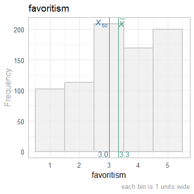

This report covers the analyses used in the analysis of the survey data.

<!--  Set the working directory to the repository's base directory; this assumes the report is nested inside of two directories.-->


<!-- Set the report-wide options, and point to the external code file. -->


<!-- Load 'sourced' R files.  Suppress the output when loading sources. --> 


<!-- Load packages, or at least verify they're available on the local machine.  Suppress the output when loading packages. --> 


<!-- Load any global functions and variables declared in the R file.  Suppress the output. --> 


<!-- Declare any global functions specific to a Rmd output.  Suppress the output. --> 


<!-- Load the datasets.   -->


<!-- Tweak the datasets.   -->


# Summary {.tabset .tabset-fade .tabset-pills}

## Notes 
1. The current report covers 1298 responses.

## Unanswered Questions

## Answered Questions

# Graphs

## Marginals
<!-- --><!-- --><!-- --><!-- -->

```
Warning: `fct_explicit_na()` was deprecated in forcats 1.0.0.
ℹ Please use `fct_na_value_to_level()` instead.
ℹ The deprecated feature was likely used in the TabularManifest package.
  Please report the issue to the authors.
This warning is displayed once every 8 hours.
Call `lifecycle::last_lifecycle_warnings()` to see where this warning was generated.
```

<!-- --><!-- --><!-- -->

## Correlations
<!-- -->

```
Warning in par(usr): argument 1 does not name a graphical parameter

Warning in par(usr): argument 1 does not name a graphical parameter

Warning in par(usr): argument 1 does not name a graphical parameter

Warning in par(usr): argument 1 does not name a graphical parameter

Warning in par(usr): argument 1 does not name a graphical parameter
```

<!-- -->


# Session Information
For the sake of documentation and reproducibility, the current report was rendered in the following environment.  Click the line below to expand.

<details>
  <summary>Environment <span class="glyphicon glyphicon-plus-sign"></span></summary>

```
─ Session info ───────────────────────────────────────────────────────────────────────────────────
 setting  value
 version  R version 4.2.3 Patched (2023-03-29 r84127 ucrt)
 os       Windows 10 x64 (build 22621)
 system   x86_64, mingw32
 ui       RTerm
 language (EN)
 collate  English_United States.utf8
 ctype    English_United States.utf8
 tz       America/Chicago
 date     2023-04-06
 pandoc   2.19.2 @ C:/Program Files/RStudio/resources/app/bin/quarto/bin/tools/ (via rmarkdown)

─ Packages ───────────────────────────────────────────────────────────────────────────────────────
 ! package         * version     date (UTC) lib source
 D archive           1.1.5       2022-05-06 [1] CRAN (R 4.2.2)
   bit               4.0.5       2022-11-15 [1] CRAN (R 4.2.2)
   bit64             4.0.5       2020-08-30 [1] CRAN (R 4.2.2)
   bslib             0.4.2       2022-12-16 [1] CRAN (R 4.2.2)
   cachem            1.0.7       2023-02-24 [1] CRAN (R 4.2.2)
   callr             3.7.3       2022-11-02 [1] CRAN (R 4.2.2)
   cli               3.6.1       2023-03-23 [1] CRAN (R 4.2.2)
   colorspace        2.1-0       2023-01-23 [1] CRAN (R 4.2.2)
   corrplot          0.92        2021-11-18 [1] CRAN (R 4.2.2)
   crayon            1.5.2       2022-09-29 [1] CRAN (R 4.2.2)
   devtools          2.4.5       2022-10-11 [1] CRAN (R 4.2.2)
   digest            0.6.31      2022-12-11 [1] CRAN (R 4.2.2)
   dplyr             1.1.1       2023-03-22 [1] CRAN (R 4.2.3)
   ellipsis          0.3.2       2021-04-29 [1] CRAN (R 4.2.2)
   evaluate          0.20        2023-01-17 [1] CRAN (R 4.2.2)
   fansi             1.0.4       2023-01-22 [1] CRAN (R 4.2.2)
   farver            2.1.1       2022-07-06 [1] CRAN (R 4.2.2)
   fastmap           1.1.1       2023-02-24 [1] CRAN (R 4.2.2)
   forcats           1.0.0       2023-01-29 [1] CRAN (R 4.2.2)
   fs                1.6.1       2023-02-06 [1] CRAN (R 4.2.2)
   generics          0.1.3       2022-07-05 [1] CRAN (R 4.2.2)
   ggplot2         * 3.4.2       2023-04-03 [1] CRAN (R 4.2.3)
   glue              1.6.2       2022-02-24 [1] CRAN (R 4.2.2)
   gtable            0.3.3       2023-03-21 [1] CRAN (R 4.2.2)
   highr             0.10        2022-12-22 [1] CRAN (R 4.2.2)
   hms               1.1.3       2023-03-21 [1] CRAN (R 4.2.3)
   htmltools         0.5.5       2023-03-23 [1] CRAN (R 4.2.2)
   htmlwidgets       1.6.2       2023-03-17 [1] CRAN (R 4.2.3)
   httpuv            1.6.9       2023-02-14 [1] CRAN (R 4.2.2)
   jquerylib         0.1.4       2021-04-26 [1] CRAN (R 4.2.2)
   jsonlite          1.8.4       2022-12-06 [1] CRAN (R 4.2.2)
   knitr           * 1.42        2023-01-25 [1] CRAN (R 4.2.2)
   labeling          0.4.2       2020-10-20 [1] CRAN (R 4.2.0)
   later             1.3.0       2021-08-18 [1] CRAN (R 4.2.2)
   lifecycle         1.0.3       2022-10-07 [1] CRAN (R 4.2.2)
   magrittr        * 2.0.3       2022-03-30 [1] CRAN (R 4.2.2)
   memoise           2.0.1       2021-11-26 [1] CRAN (R 4.2.2)
   mime              0.12        2021-09-28 [1] CRAN (R 4.2.0)
   miniUI            0.1.1.1     2018-05-18 [1] CRAN (R 4.2.2)
   munsell           0.5.0       2018-06-12 [1] CRAN (R 4.2.2)
   pillar            1.9.0       2023-03-22 [1] CRAN (R 4.2.3)
   pkgbuild          1.4.0       2022-11-27 [1] CRAN (R 4.2.2)
   pkgconfig         2.0.3       2019-09-22 [1] CRAN (R 4.2.2)
   pkgload           1.3.2       2022-11-16 [1] CRAN (R 4.2.2)
   prettyunits       1.1.1       2020-01-24 [1] CRAN (R 4.2.2)
   processx          3.8.0       2022-10-26 [1] CRAN (R 4.2.2)
   profvis           0.3.7       2020-11-02 [1] CRAN (R 4.2.2)
   promises          1.2.0.1     2021-02-11 [1] CRAN (R 4.2.2)
   ps                1.7.4       2023-04-02 [1] CRAN (R 4.2.3)
   purrr             1.0.1       2023-01-10 [1] CRAN (R 4.2.2)
   R6                2.5.1       2021-08-19 [1] CRAN (R 4.2.2)
   Rcpp              1.0.10      2023-01-22 [1] CRAN (R 4.2.2)
   readr             2.1.4       2023-02-10 [1] CRAN (R 4.2.2)
   remotes           2.4.2       2021-11-30 [1] CRAN (R 4.2.2)
   rlang             1.1.0       2023-03-14 [1] CRAN (R 4.2.3)
   rmarkdown         2.21        2023-03-26 [1] CRAN (R 4.2.3)
   rstudioapi        0.14        2022-08-22 [1] CRAN (R 4.2.2)
   sass              0.4.5       2023-01-24 [1] CRAN (R 4.2.2)
   scales            1.2.1       2022-08-20 [1] CRAN (R 4.2.2)
   sessioninfo       1.2.2       2021-12-06 [1] CRAN (R 4.2.2)
   shiny             1.7.4       2022-12-15 [1] CRAN (R 4.2.2)
   stringi           1.7.12      2023-01-11 [1] CRAN (R 4.2.2)
   stringr           1.5.0       2022-12-02 [1] CRAN (R 4.2.2)
   TabularManifest   0.1-16.9003 2022-12-11 [1] Github (Melinae/TabularManifest@b966a2b)
   tibble            3.2.1       2023-03-20 [1] CRAN (R 4.2.2)
   tidyselect        1.2.0       2022-10-10 [1] CRAN (R 4.2.2)
   tzdb              0.3.0       2022-03-28 [1] CRAN (R 4.2.2)
   urlchecker        1.0.1       2021-11-30 [1] CRAN (R 4.2.2)
   usethis           2.1.6       2022-05-25 [1] CRAN (R 4.2.2)
   utf8              1.2.3       2023-01-31 [1] CRAN (R 4.2.2)
   vctrs             0.6.1       2023-03-22 [1] CRAN (R 4.2.3)
   vroom             1.6.1       2023-01-22 [1] CRAN (R 4.2.2)
   withr             2.5.0       2022-03-03 [1] CRAN (R 4.2.2)
   xfun              0.38        2023-03-24 [1] CRAN (R 4.2.3)
   xtable            1.8-4       2019-04-21 [1] CRAN (R 4.2.2)
   yaml              2.3.7       2023-01-23 [1] CRAN (R 4.2.2)

 [1] C:/Users/wibea/AppData/Local/R/win-library/4.2
 [2] C:/Program Files/R/R-4.2.3patched/library

 D ── DLL MD5 mismatch, broken installation.

──────────────────────────────────────────────────────────────────────────────────────────────────
```
</details>


Report rendered by wibea at 2023-04-06, 17:37 -0500 in 2 seconds.

