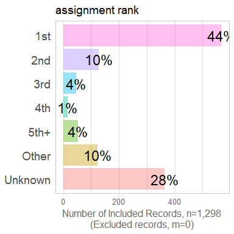
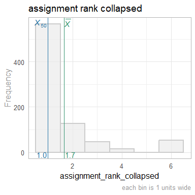
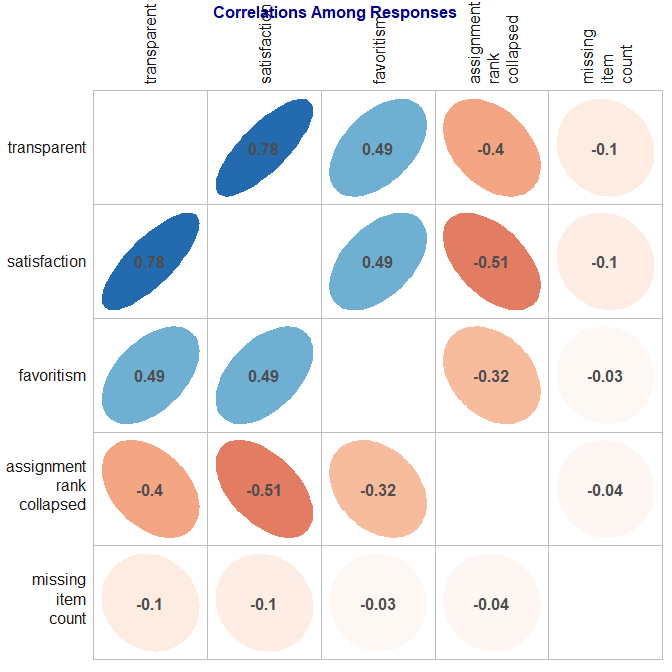

# Survey EDA
Date: `r Sys.Date()`  

This report covers the analyses used in the analysis of the survey data.

<!--  Set the working directory to the repository's base directory; this assumes the report is nested inside of two directories.-->


<!-- Set the report-wide options, and point to the external code file. -->


<!-- Load 'sourced' R files.  Suppress the output when loading sources. --> 


<!-- Load packages, or at least verify they're available on the local machine.  Suppress the output when loading packages. --> 


<!-- Load any global functions and variables declared in the R file.  Suppress the output. --> 


<!-- Declare any global functions specific to a Rmd output.  Suppress the output. --> 


<!-- Load the datasets.   -->


<!-- Tweak the datasets.   -->


# Summary {.tabset .tabset-fade .tabset-pills}

## Notes 
1. The current report covers 1298 responses.

## Unanswered Questions

## Answered Questions

# Graphs

## Marginals
<!-- --><!-- --><!-- --><!-- --><!-- --><!-- --><!-- -->

## Correlations
<!-- --><!-- -->


# Session Information
For the sake of documentation and reproducibility, the current report was rendered in the following environment.  Click the line below to expand.

<details>
  <summary>Environment <span class="glyphicon glyphicon-plus-sign"></span></summary>

```
Session info --------------------------------------------------------------------------------------
```

```
 setting  value                       
 version  R version 3.4.1 (2017-06-30)
 system   x86_64, linux-gnu           
 ui       X11                         
 language en_US                       
 collate  en_US.UTF-8                 
 tz       America/Chicago             
 date     2017-07-03                  
```

```
Packages ------------------------------------------------------------------------------------------
```

```
 package         * version     date       source                                  
 assertthat        0.2.0       2017-04-11 CRAN (R 3.4.0)                          
 backports         1.1.0       2017-05-22 CRAN (R 3.4.0)                          
 base            * 3.4.1       2017-07-01 local                                   
 bindr             0.1         2016-11-13 CRAN (R 3.4.1)                          
 bindrcpp        * 0.2         2017-06-17 CRAN (R 3.4.0)                          
 colorspace        1.3-2       2016-12-14 CRAN (R 3.4.1)                          
 compiler          3.4.1       2017-07-01 local                                   
 corrplot          0.77        2016-04-21 CRAN (R 3.4.1)                          
 datasets        * 3.4.1       2017-07-01 local                                   
 devtools          1.13.2      2017-06-02 CRAN (R 3.4.0)                          
 digest            0.6.12      2017-01-27 CRAN (R 3.4.1)                          
 dplyr             0.7.1       2017-06-22 CRAN (R 3.4.0)                          
 evaluate          0.10.1      2017-06-24 CRAN (R 3.4.0)                          
 ggplot2         * 2.2.1       2016-12-30 CRAN (R 3.4.1)                          
 glue              1.1.1       2017-06-21 CRAN (R 3.4.0)                          
 graphics        * 3.4.1       2017-07-01 local                                   
 grDevices       * 3.4.1       2017-07-01 local                                   
 grid              3.4.1       2017-07-01 local                                   
 gtable            0.2.0       2016-02-26 CRAN (R 3.4.1)                          
 hms               0.3         2016-11-22 CRAN (R 3.4.1)                          
 htmltools         0.3.6       2017-04-28 CRAN (R 3.4.0)                          
 knitr           * 1.16        2017-05-18 CRAN (R 3.4.0)                          
 labeling          0.3         2014-08-23 CRAN (R 3.4.1)                          
 lazyeval          0.2.0       2016-06-12 CRAN (R 3.4.1)                          
 magrittr        * 1.5         2014-11-22 CRAN (R 3.4.1)                          
 memoise           1.1.0       2017-04-21 CRAN (R 3.4.0)                          
 methods         * 3.4.1       2017-07-01 local                                   
 munsell           0.4.3       2016-02-13 CRAN (R 3.4.1)                          
 pkgconfig         2.0.1       2017-03-21 CRAN (R 3.4.1)                          
 plyr              1.8.4       2016-06-08 CRAN (R 3.4.1)                          
 R6                2.2.2       2017-06-17 CRAN (R 3.4.0)                          
 Rcpp              0.12.11     2017-05-22 CRAN (R 3.4.0)                          
 readr             1.1.1       2017-05-16 CRAN (R 3.4.0)                          
 rlang             0.1.1.9000  2017-07-02 Github (hadley/rlang@ff87439)           
 rmarkdown         1.6         2017-06-15 CRAN (R 3.4.0)                          
 rprojroot         1.2         2017-01-16 CRAN (R 3.4.1)                          
 scales            0.4.1       2016-11-09 CRAN (R 3.4.1)                          
 stats           * 3.4.1       2017-07-01 local                                   
 stringi           1.1.5       2017-04-07 CRAN (R 3.4.1)                          
 stringr           1.2.0       2017-02-18 CRAN (R 3.4.1)                          
 TabularManifest   0.1-16.9001 2017-07-03 Github (Melinae/TabularManifest@de7a3e8)
 tibble            1.3.3       2017-06-01 Github (tidyverse/tibble@b2275d5)       
 tools             3.4.1       2017-07-01 local                                   
 utils           * 3.4.1       2017-07-01 local                                   
 withr             1.0.2       2016-06-20 CRAN (R 3.4.1)                          
 yaml              2.1.14      2016-11-12 CRAN (R 3.4.1)                          
```
</details>


Report rendered by wibeasley at 2017-07-03, 14:39 -0500 in 8 seconds.

